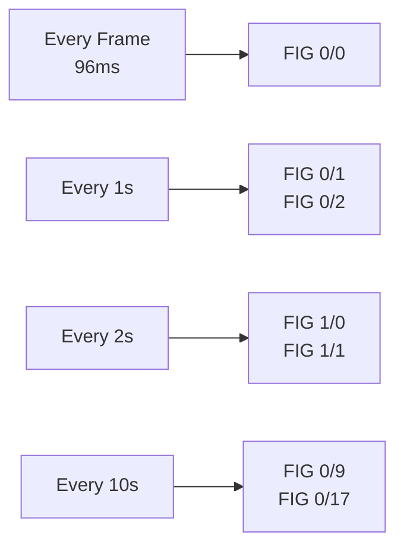

# FIG Types Reference

Complete reference for Fast Information Group (FIG) types in DAB.

## Overview

FIGs (Fast Information Groups) carry service information in the FIC (Fast Information Channel). They describe the ensemble, services, and how to decode them.

**FIG structure:**
- Transmitted in FIC (96 bytes Mode I, 32 bytes others)
- Multiple FIGs per FIC frame
- Carousel rotation for repeated transmission
- Each FIG type has specific repetition rate

## FIG Classification

FIGs are organized by **type** (0-7) and **extension** (0-31):

| Type | Purpose | Examples |
|------|---------|----------|
| **0** | MCI - Multiplex Configuration Info | 0/0, 0/1, 0/2 |
| **1** | Labels | 1/0, 1/1 |
| **2** | Dynamic labels | 2/0, 2/1 |
| **5** | FIDC | 5/0, 5/1 |
| **6** | Conditional Access | 6/0 |

**Notation:** FIG X/Y means Type X, Extension Y

## FIG Type 0 (MCI)

Multiplex Configuration Information - Essential ensemble structure.

### FIG 0/0 - Ensemble Information

**Purpose:** Basic ensemble configuration

**Content:**
- Ensemble ID (16 bits)
- Change flags
- Alarm flag
- CIF count

**Repetition:** Every frame (96ms for Mode I)

**Structure:**
```
┌────────┬────────────┬──────────┬───────────┐
│ Header │ Ensemble ID│ Flags    │ CIF Count │
│ 1 byte │ 2 bytes    │ 2 bytes  │ 1 byte    │
└────────┴────────────┴──────────┴───────────┘
```

**Example data:**
```python
ensemble_id = 0xCE15
change_flag = 0
alarm_flag = 0
cif_count = 0  # Wraps 0-249

fig_0_0 = bytes([
    0x00,  # Type 0, Extension 0
    (ensemble_id >> 8) & 0xFF,
    ensemble_id & 0xFF,
    (change_flag << 6) | (alarm_flag << 5),
    cif_count
])
```

---

### FIG 0/1 - Subchannel Organization

**Purpose:** Define subchannels in the multiplex

**Content for each subchannel:**
- Subchannel ID (6 bits)
- Start address (10 bits)
- Table index / protection (6 bits)
- Short/long form flag

**Repetition:** Every 1 second

**Structure (short form):**
```
┌────────┬──────────────┬───────────────┬────────────┐
│ Header │ SubChId+Addr │ Table/Form    │ (repeat)   │
│ 1 byte │ 2 bytes      │ 1 byte        │ ...        │
└────────┴──────────────┴───────────────┴────────────┘
```

**Example (128 kbps, protection 2):**
```python
subchannel_id = 0      # 6 bits
start_address = 0      # 10 bits (in CU)
table_index = 8        # For 128 kbps, prot 2
short_form = 1         # UEP (short form)

# Pack into bytes
byte1 = (subchannel_id << 2) | (start_address >> 8)
byte2 = start_address & 0xFF
byte3 = (table_index << 2) | (short_form << 0)
```

---

### FIG 0/2 - Service Organization

**Purpose:** Link services to components and subchannels

**Content:**
- Service ID (16 or 32 bits)
- Number of components
- Component details:
  - Service component ID
  - Transport mechanism
  - Subchannel ID or FIDCId

**Repetition:** Every 1 second

**Structure:**
```
┌────────┬────────────┬────────┬─────────────────┐
│ Header │ Service ID │ #Comps │ Component Info  │
│ 1 byte │ 2-4 bytes  │ 1 byte │ 2 bytes each    │
└────────┴────────────┴────────┴─────────────────┘
```

**Example (audio service):**
```python
service_id = 0x5001     # 16-bit
num_components = 1
component_type = 0      # Audio (stream mode)
subchannel_id = 0

fig_0_2 = bytes([
    0x02,  # Type 0, Extension 2
    (service_id >> 8) & 0xFF,
    service_id & 0xFF,
    num_components,
    (component_type << 6) | subchannel_id
])
```

---

### FIG 0/3 - Service Component in Packet Mode

**Purpose:** Describe packet mode data services

**Repetition:** Every 1 second

**Usage:** Rare in audio-only ensembles

---

### FIG 0/5 - Service Component Language

**Purpose:** Specify language for each component

**Content:**
- Service component ID
- Language code (8 bits)

**Repetition:** Every 2 seconds

**Example (English):**
```python
language_code = 9  # English

fig_0_5 = bytes([
    0x05,  # Type 0, Extension 5
    # ... component ID and language
])
```

---

### FIG 0/8 - Service Component Global Definition

**Purpose:** Additional service component info

**Content:**
- Service ID
- Component characteristics
- Service component ID (SCIdS)

**Repetition:** Every 2 seconds

---

### FIG 0/9 - Country, LTO and International table

**Purpose:** Country ID and local time offset

**Content:**
- Service ID
- Extended country code (ECC)
- Local time offset (LTO)

**Repetition:** Every 10 seconds

**Example:**
```python
ecc = 0xE1      # Germany
lto = 0         # UTC
lto_auto = 1    # Automatic LTO

fig_0_9 = bytes([
    0x09,  # Type 0, Extension 9
    # ... service ID, ECC, LTO
])
```

---

### FIG 0/10 - Date and Time

**Purpose:** Current date and time

**Content:**
- Modified Julian Date (MJD)
- Hours, minutes, seconds
- Milliseconds
- Local time offset

**Repetition:** Every 1 second

**Not typically implemented** - receivers use RDS/GPS time.

---

### FIG 0/13 - User Application Information

**Purpose:** User applications (SLS, MOT, etc.)

**Repetition:** Every 10 seconds

**Usage:** For data services (MOT slideshow, etc.)

---

### FIG 0/17 - Programme Type

**Purpose:** Programme type (PTY) for each service

**Content:**
- Service ID
- PTY code (5 bits)

**Repetition:** Every 10 seconds

**Example (Pop Music):**
```python
service_id = 0x5001
pty = 10  # Pop Music

fig_0_17 = bytes([
    0x11,  # Type 0, Extension 17
    (service_id >> 8) & 0xFF,
    service_id & 0xFF,
    (pty << 3)
])
```

---

## FIG Type 1 (Labels)

Service and ensemble labels.

### FIG 1/0 - Ensemble Label

**Purpose:** Ensemble name (16 characters)

**Content:**
- Ensemble ID
- Label (16 bytes, EBU Latin)
- Short label flag (16 bits)

**Repetition:** Every 2 seconds

**Example:**
```python
ensemble_id = 0xCE15
label = b'My DAB Ensemble '  # 16 bytes, padded
short_label_flag = 0x1F00  # "My DAB" (first 6 chars)

fig_1_0 = bytes([
    0x20,  # Type 1, Extension 0
    (ensemble_id >> 8) & 0xFF,
    ensemble_id & 0xFF,
]) + label + bytes([
    (short_label_flag >> 8) & 0xFF,
    short_label_flag & 0xFF
])
```

---

### FIG 1/1 - Service Label

**Purpose:** Service name (16 characters)

**Content:**
- Service ID
- Label (16 bytes)
- Short label flag

**Repetition:** Every 2 seconds

**Example:**
```python
service_id = 0x5001
label = b'Radio One       '  # 16 bytes
short_label_flag = 0xFF00  # "Radio One" (first 9 chars)

fig_1_1 = bytes([
    0x21,  # Type 1, Extension 1
    (service_id >> 8) & 0xFF,
    service_id & 0xFF,
]) + label + bytes([
    (short_label_flag >> 8) & 0xFF,
    short_label_flag & 0xFF
])
```

---

### FIG 1/4 - Service Component Label

**Purpose:** Component name

**Repetition:** Every 10 seconds

**Usage:** Rarely used

---

### FIG 1/5 - Data Service Label

**Purpose:** Data service name

**Repetition:** Every 10 seconds

**Usage:** For data services only

---

## FIG Type 2 (Dynamic Labels)

Dynamic Label Segment (DLS) for scrolling text.

### FIG 2/0 - Ensemble Dynamic Label

**Purpose:** Scrolling ensemble text

**Usage:** Not commonly used

---

### FIG 2/1 - Service Component Dynamic Label

**Purpose:** Scrolling text (now playing, etc.)

**Content:**
- Service component ID
- Text segments
- Charset indicator

**Repetition:** As needed (variable)

**Usage:** DAB+ stations for "now playing" info

---

## FIG Type 5 (FIDC)

Fast Information Data Channel.

### FIG 5/0 - Paging

**Purpose:** Paging information

**Usage:** Rarely used

---

### FIG 5/1 - Traffic Message Channel (TMC)

**Purpose:** Traffic information

**Usage:** Specialized data services

---

## FIG Type 6 (Conditional Access)

### FIG 6/0 - CA System

**Purpose:** Conditional access information

**Usage:** Encrypted services only

---

## FIG Carousel

FIGs are transmitted in rotation based on repetition rates:



### Priority Order

1. **FIG 0/0** - Every frame (critical)
2. **FIG 0/1, 0/2** - Every 1 second (essential)
3. **FIG 1/0, 1/1** - Every 2 seconds (important)
4. **FIG 0/5, 0/8** - Every 2 seconds (optional)
5. **FIG 0/9, 0/17** - Every 10 seconds (metadata)

### FIC Space Usage

**Mode I (96 bytes FIC per frame):**
```
Available space: ~90 bytes (after header)
Typical usage:
  FIG 0/0: 6 bytes
  FIG 0/1: 4 bytes × subchannels
  FIG 0/2: 6 bytes × services
  FIG 1/0: 19 bytes (ensemble label)
  FIG 1/1: 19 bytes × services (rotated)
```

**Mode II/III/IV (32 bytes FIC per frame):**
```
Available space: ~30 bytes
Must be selective about which FIGs to include
```

## Implementation in python-dabmux

### Enabled by Default

- ✅ FIG 0/0 - Ensemble info
- ✅ FIG 0/1 - Subchannel organization
- ✅ FIG 0/2 - Service organization
- ✅ FIG 1/0 - Ensemble label
- ✅ FIG 1/1 - Service labels
- ✅ FIG 0/17 - Programme type

### Optional/Not Implemented

- ⚠️ FIG 0/5 - Language (can be added)
- ⚠️ FIG 0/9 - Country/LTO (can be added)
- ❌ FIG 2/x - Dynamic labels (not yet)
- ❌ FIG 5/x - FIDC (rarely needed)
- ❌ FIG 6/x - CA (specialized)

### Custom FIG Generation

See [Extending python-dabmux](extending.md) for creating custom FIG generators.

## Debugging FIGs

### Parse FIC Data

```python
from dabmux.fig.fic import FICEncoder

# Generate FIC
fic_encoder = FICEncoder(ensemble)
fic_data = fic_encoder.encode_fic(frame_number=0)

# Parse FIGs
offset = 0
while offset < len(fic_data):
    if fic_data[offset] == 0xFF:  # Padding
        break

    fig_type = (fic_data[offset] >> 5) & 0x07
    fig_ext = fic_data[offset] & 0x1F

    print(f"FIG {fig_type}/{fig_ext}")

    # Skip to next FIG (implementation dependent)
    offset += fig_length
```

### Validation

Check FIG correctness with:
1. **ODR-DabMux** - Compare output
2. **DAB receiver** - Does it decode correctly?
3. **FIG parser** - Validate structure

## See Also

- [FIG Carousel](../architecture/fig-carousel.md) - Carousel implementation
- [Basic Concepts](../getting-started/basic-concepts.md) - FIG overview
- [ETSI EN 300 401](../standards/index.md) - Complete FIG specification
- [API: FIG Module](../api-reference/fig.md) - FIG generation API
