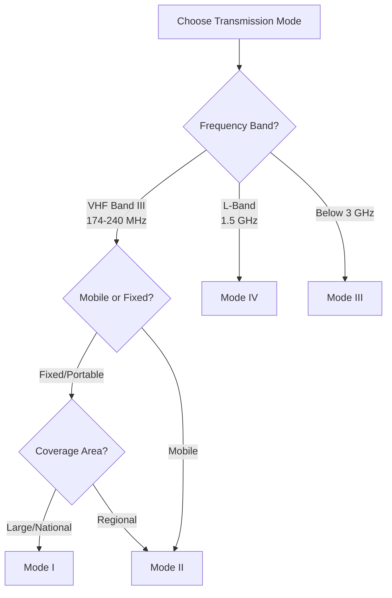

# Transmission Modes

Complete guide to DAB transmission modes (I, II, III, IV) with technical details and capacity calculations.

## Overview

DAB defines four transmission modes optimized for different coverage scenarios and frequency bands. The mode affects frame timing, FIC size, and total capacity.

## Mode Comparison Table

| Parameter | Mode I | Mode II | Mode III | Mode IV |
|-----------|--------|---------|----------|---------|
| **Frame Duration** | 96 ms | 24 ms | 24 ms | 96 ms |
| **Symbols per Frame** | 76 | 76 | 153 | 76 |
| **FIC Size** | 96 bytes | 32 bytes | 32 bytes | 32 bytes |
| **Total Capacity (CU)** | 864 | 432 | 864 | 432 |
| **Typical Use** | VHF Band III | VHF Band III (mobile) | < 3 GHz | L-Band (1.5 GHz) |
| **Max Range** | Large area | Medium area | Medium area | Local/mobile |
| **Guard Interval** | 246 μs | 62 μs | 31 μs | 123 μs |

## Mode I (Most Common)

### Characteristics

- **Frame duration**: 96 ms (10.416̄ frames/second)
- **FIC size**: 96 bytes (3 FIBs × 32 bytes)
- **MST capacity**: 864 CU
- **ETI frame size**: 6144 bytes (6148 with TIST)

### Use Cases

- **Primary use**: VHF Band III (174-240 MHz)
- **Coverage**: Large area, national networks
- **Environment**: Fixed reception, portable radios
- **Typical**: Most DAB transmissions worldwide

### Frame Structure

```
┌─────────┬──────────┬────────────┬─────────┬────────────┐
│ SYNC    │ FC       │ STC × N    │ EOH     │ FIC (96 B) │
│ 4 bytes │ 4 bytes  │ 4×N bytes  │ 4 bytes │            │
└─────────┴──────────┴────────────┴─────────┴────────────┘
         ┌────────────┬──────┬──────────┐
         │ MST        │ EOF  │ TIST     │
         │ ~5760 B    │ 4 B  │ 4 B (opt)│
         └────────────┴──────┴──────────┘
```

### Capacity Calculation

Total capacity: **864 CU**

Example ensemble (Mode I):
```
Service 1: 128 kbps, protection 2 → ~84 CU
Service 2: 128 kbps, protection 2 → ~84 CU
Service 3: 96 kbps, protection 2  → ~63 CU
Service 4: 96 kbps, protection 2  → ~63 CU
Service 5: 64 kbps, protection 2  → ~42 CU
Service 6: 64 kbps, protection 2  → ~42 CU
                             Total: ~378 CU (44% of 864)
```

Can fit **6-8 services** at standard quality.

### Configuration

```yaml
ensemble:
  transmission_mode: 'I'  # or 1
```

---

## Mode II

### Characteristics

- **Frame duration**: 24 ms (41.6̄ frames/second)
- **FIC size**: 32 bytes (1 FIB)
- **MST capacity**: 432 CU (half of Mode I)
- **ETI frame size**: ~3100 bytes

### Use Cases

- **Primary use**: VHF Band III (mobile reception)
- **Coverage**: Medium area, regional networks
- **Environment**: Fast-moving vehicles
- **Benefits**: Better Doppler shift handling

### Frame Structure

```
┌─────────┬──────────┬────────────┬─────────┬────────────┐
│ SYNC    │ FC       │ STC × N    │ EOH     │ FIC (32 B) │
│ 4 bytes │ 4 bytes  │ 4×N bytes  │ 4 bytes │            │
└─────────┴──────────┴────────────┴─────────┴────────────┘
         ┌────────────┬──────┐
         │ MST        │ EOF  │
         │ ~3000 B    │ 4 B  │
         └────────────┴──────┘
```

### Capacity

Total capacity: **432 CU** (50% of Mode I)

Example ensemble:
```
Service 1: 96 kbps, protection 2  → ~63 CU
Service 2: 96 kbps, protection 2  → ~63 CU
Service 3: 64 kbps, protection 2  → ~42 CU
Service 4: 64 kbps, protection 2  → ~42 CU
                             Total: ~210 CU (49% of 432)
```

Can fit **3-5 services** at standard quality.

### Configuration

```yaml
ensemble:
  transmission_mode: 'II'  # or 2
```

---

## Mode III

### Characteristics

- **Frame duration**: 24 ms (41.6̄ frames/second)
- **FIC size**: 32 bytes
- **MST capacity**: 864 CU (same as Mode I)
- **Symbols**: 153 (double Mode II)

### Use Cases

- **Primary use**: Frequencies below 3 GHz
- **Coverage**: Medium to large area
- **Benefits**: More capacity than Mode II, faster updates than Mode I

### Frame Structure

Similar to Mode II but with double the MST capacity.

### Capacity

Total capacity: **864 CU** (same as Mode I)

Can fit **6-8 services** at standard quality, with faster frame rate than Mode I.

### Configuration

```yaml
ensemble:
  transmission_mode: 'III'  # or 3
```

---

## Mode IV

### Characteristics

- **Frame duration**: 96 ms (10.416̄ frames/second)
- **FIC size**: 32 bytes
- **MST capacity**: 432 CU (same as Mode II)

### Use Cases

- **Primary use**: L-Band (1.5 GHz)
- **Coverage**: Local, mobile services
- **Environment**: Urban areas, complementary services

### Capacity

Total capacity: **432 CU** (same as Mode II)

Can fit **3-5 services** at standard quality.

### Configuration

```yaml
ensemble:
  transmission_mode: 'IV'  # or 4
```

---

## Choosing a Transmission Mode

### Decision Tree



### Recommendations

**Use Mode I if:**
- ✅ VHF Band III (174-240 MHz)
- ✅ Large coverage area (national network)
- ✅ Fixed or portable reception
- ✅ Maximum capacity needed (6-8 services)
- ✅ **Most common choice**

**Use Mode II if:**
- ✅ VHF Band III
- ✅ Mobile reception (vehicles)
- ✅ Better Doppler tolerance needed
- ✅ Fewer services (3-5)

**Use Mode III if:**
- ✅ Frequencies below 3 GHz
- ✅ Large capacity with faster frame rate
- ✅ Specialized deployment

**Use Mode IV if:**
- ✅ L-Band (1.5 GHz)
- ✅ Local or mobile services
- ✅ Urban areas

## Frame Timing Details

### Mode I Timing

```
Frame duration: 96 ms
─────────────────────────────────────────────────
│ NULL │ OFDM Symbol × 76 │
│ 1.297│     ~1.246 ms each │
│  ms  │                    │
─────────────────────────────────────────────────
         Total: 96 ms (10.416̄ fps)

Guard interval: 246 μs
Symbol duration: 1.246 ms
```

### Mode II Timing

```
Frame duration: 24 ms
──────────────────────────────
│ NULL │ OFDM Symbol × 76 │
│ 324  │    ~311.5 μs each│
│  μs  │                  │
──────────────────────────────
     Total: 24 ms (41.6̄ fps)

Guard interval: 62 μs
Symbol duration: 311.5 μs
```

## Capacity Unit (CU) Calculations

One Capacity Unit (CU) = 8 kbps equivalent.

### Bitrate to CU Conversion

| Bitrate | Protection | CUs (approx) |
|---------|-----------|--------------|
| 32 kbps | Level 2 | 18 |
| 64 kbps | Level 2 | 42 |
| 96 kbps | Level 2 | 63 |
| 128 kbps | Level 2 | 84 |
| 160 kbps | Level 2 | 105 |
| 192 kbps | Level 2 | 126 |

**Note**: Higher protection levels require more CUs for the same bitrate.

### Protection Level Impact

| Bitrate | Protection 1 | Protection 2 | Protection 3 | Protection 4 |
|---------|-------------|-------------|-------------|-------------|
| 128 kbps | 76 CU | 84 CU | 96 CU | 116 CU |

Higher protection = more error correction = more CUs needed.

## ETI Frame Size by Mode

| Mode | Frame Size (bytes) | With TIST |
|------|-------------------|-----------|
| I | 6144 | 6148 |
| II | ~3072 | ~3076 |
| III | ~6144 | ~6148 |
| IV | ~3072 | ~3076 |

**Note**: Exact MST size depends on number and configuration of subchannels.

## FIC Capacity by Mode

| Mode | FIBs per Frame | Total FIC Size | FIG Capacity |
|------|---------------|---------------|--------------|
| I | 3 | 96 bytes | 3 × 30 bytes = 90 bytes |
| II | 1 | 32 bytes | 30 bytes |
| III | 1 | 32 bytes | 30 bytes |
| IV | 1 | 32 bytes | 30 bytes |

Mode I can carry **3× more FIG data** per frame.

## Programming Examples

### Mode I Configuration

```yaml
ensemble:
  id: '0xCE15'
  transmission_mode: 'I'
  label:
    text: 'National DAB'

# Can fit 6-8 services at 128 kbps
subchannels:
  - id: 0
    bitrate: 128
    start_address: 0
  - id: 1
    bitrate: 128
    start_address: 84
  # ... up to 8 services
```

### Mode II Configuration

```yaml
ensemble:
  id: '0xCE15'
  transmission_mode: 'II'
  label:
    text: 'Mobile DAB'

# Can fit 3-5 services
subchannels:
  - id: 0
    bitrate: 96
    start_address: 0
  - id: 1
    bitrate: 96
    start_address: 63
  # ... up to 5 services
```

### Runtime Mode Detection

```python
from dabmux.core.eti import TransmissionMode

# Get mode from ensemble
mode = ensemble.transmission_mode

# Check mode
if mode == TransmissionMode.TM_I:
    print("Mode I: 96ms frames, 864 CU capacity")
elif mode == TransmissionMode.TM_II:
    print("Mode II: 24ms frames, 432 CU capacity")

# Get frame properties
frame_duration_ms = {
    TransmissionMode.TM_I: 96,
    TransmissionMode.TM_II: 24,
    TransmissionMode.TM_III: 24,
    TransmissionMode.TM_IV: 96
}[mode]

fic_size = {
    TransmissionMode.TM_I: 96,
    TransmissionMode.TM_II: 32,
    TransmissionMode.TM_III: 32,
    TransmissionMode.TM_IV: 32
}[mode]
```

## See Also

- [Architecture: ETI Frames](../architecture/eti-frames.md) - Frame structure details
- [Configuration: Subchannels](../user-guide/configuration/subchannels.md) - Capacity planning
- [Core API](../api-reference/core.md) - TransmissionMode enum
- [ETSI EN 300 401](https://www.etsi.org/deliver/etsi_en/300400_300499/300401/) - Official specification
