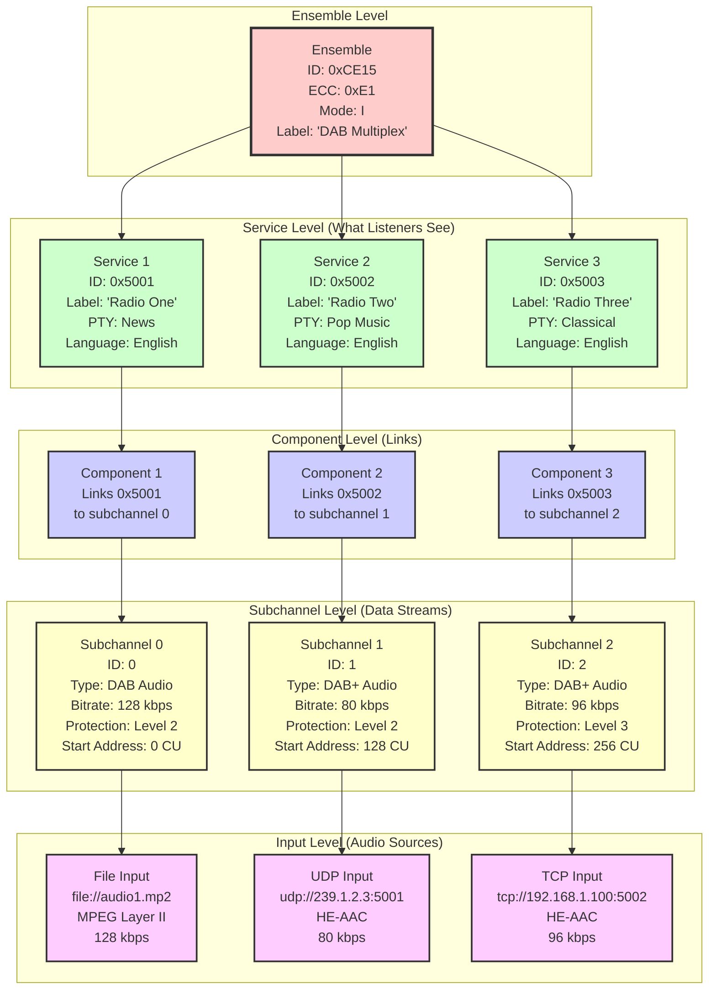
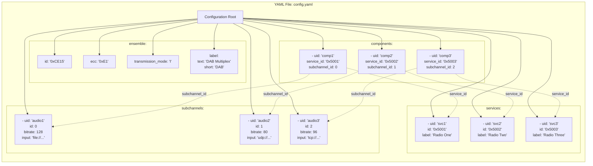

# Configuration Hierarchy

Tree diagram showing the relationship between configuration elements and how they link together.

## Configuration Hierarchy Diagram



## Alternative View: YAML Configuration Structure



## Hierarchy Levels Explained

### Level 1: Ensemble (Top Level)

**Purpose:** Container for entire DAB multiplex

**Key Properties:**
- **Ensemble ID** (`id`): Unique 16-bit identifier (e.g., `0xCE15`)
- **Extended Country Code** (`ecc`): Country identifier (e.g., `0xE1` for Germany)
- **Transmission Mode** (`transmission_mode`): RF characteristics (I, II, III, or IV)
- **Label**: Ensemble name displayed to listeners
- **LTO**: Local Time Offset

**One per configuration file**

**YAML Example:**
```yaml
ensemble:
  id: '0xCE15'
  ecc: '0xE1'
  transmission_mode: 'I'
  label:
    text: 'DAB Multiplex'
    short: 'DAB'
  lto_auto: true
```

**Role:** Defines the overall broadcast parameters that apply to all services.

---

### Level 2: Services (Radio Stations)

**Purpose:** Define radio stations that listeners can tune to

**Key Properties:**
- **Service ID** (`id`): Unique identifier for this service (e.g., `0x5001`)
- **Label**: Station name (max 16 characters)
- **Short Label**: Abbreviated name (max 8 characters)
- **PTY** (Programme Type): Genre/category (News, Music, etc.)
- **Language**: Language code

**Multiple services per ensemble** (typically 3-10)

**YAML Example:**
```yaml
services:
  - uid: 'radio_one'
    id: '0x5001'
    label:
      text: 'Radio One'
      short: 'Radio1'
    pty: 1       # News
    language: 9  # English

  - uid: 'radio_two'
    id: '0x5002'
    label:
      text: 'Radio Two'
      short: 'Radio2'
    pty: 10      # Pop Music
    language: 9
```

**Role:** Represents what listeners see in their radio's station list.

---

### Level 3: Components (Links)

**Purpose:** Link services to subchannels

**Key Properties:**
- **Service ID** (`service_id`): Which service this belongs to
- **Subchannel ID** (`subchannel_id`): Which subchannel carries the data
- **Type**: Component type (0=Audio, 60=PAD, etc.)

**One or more components per service**

**YAML Example:**
```yaml
components:
  - uid: 'comp1'
    service_id: '0x5001'    # Links to Radio One
    subchannel_id: 0        # Uses subchannel 0
    type: 0                 # Audio component

  - uid: 'comp2'
    service_id: '0x5002'    # Links to Radio Two
    subchannel_id: 1        # Uses subchannel 1
    type: 0
```

**Role:** Creates the mapping between what listeners see (services) and the actual data streams (subchannels).

**Important:** `service_id` must match a service's `id`, and `subchannel_id` must match a subchannel's `id`.

---

### Level 4: Subchannels (Data Streams)

**Purpose:** Define the actual audio/data streams

**Key Properties:**
- **Subchannel ID** (`id`): Unique identifier (0-63)
- **Type**: Stream type (audio, dabplus, packet, data)
- **Bitrate**: Data rate in kbps
- **Start Address**: Position in Capacity Units (CU)
- **Protection**: Error protection configuration
- **Input URI**: Source of audio data

**One per audio stream**

**YAML Example:**
```yaml
subchannels:
  - uid: 'audio1'
    id: 0
    type: 'audio'           # DAB (MPEG Layer II)
    bitrate: 128            # 128 kbps
    start_address: 0        # Starts at CU 0
    protection:
      level: 2              # Moderate protection
      shortform: true
    input: 'file://audio1.mp2'

  - uid: 'audio2'
    id: 1
    type: 'dabplus'         # DAB+ (HE-AAC)
    bitrate: 80
    start_address: 128      # Starts at CU 128
    protection:
      level: 2
    input: 'udp://239.1.2.3:5001'
```

**Role:** Describes the actual data streams that carry audio, including where they start in the multiplex and how they're protected.

---

### Level 5: Inputs (Audio Sources)

**Purpose:** Define where audio data comes from

**Types:**
- **File**: `file://path/to/audio.mp2`
- **UDP**: `udp://host:port`
- **TCP**: `tcp://host:port`

**One input per subchannel** (specified in subchannel's `input` field)

**Examples:**
```yaml
# File input (local or absolute path)
input: 'file://audio.mp2'
input: 'file:///absolute/path/audio.mp2'

# UDP unicast
input: 'udp://192.168.1.100:5001'

# UDP multicast
input: 'udp://239.1.2.3:5001'

# TCP
input: 'tcp://192.168.1.100:5002'
```

**Role:** Provides the actual audio data to feed into the subchannels.

---

## ID Relationships

### How IDs Link Together

```
Service ID (0x5001)
    ↓ (referenced by component)
Component: service_id = 0x5001, subchannel_id = 0
    ↓ (links to subchannel)
Subchannel ID (0)
    ↓ (has input)
Input URI
```

**Example:**
1. **Service** `0x5001` is "Radio One"
2. **Component** links service `0x5001` to subchannel `0`
3. **Subchannel** `0` is 128 kbps DAB audio
4. **Input** `file://audio.mp2` provides data

**Result:** When listener tunes to "Radio One" (0x5001), receiver knows to decode subchannel 0, which gets data from audio.mp2.

### ID Validation

**python-dabmux validates:**

1. **Unique service IDs**: No two services can have same ID
2. **Unique subchannel IDs**: No two subchannels can have same ID
3. **Valid component references**:
   - `service_id` must exist in services
   - `subchannel_id` must exist in subchannels
4. **Capacity limits**: Total subchannels fit in available bandwidth

---

## Complete Example Configuration

```yaml
# Ensemble configuration
ensemble:
  id: '0xCE15'              # Ensemble ID
  ecc: '0xE1'               # Germany
  transmission_mode: 'I'     # Mode I (standard)
  label:
    text: 'My DAB'
    short: 'DAB'
  lto_auto: true            # Auto local time offset

# Subchannels (data streams)
subchannels:
  # Classical station: high quality DAB
  - uid: 'classical_audio'
    id: 0
    type: 'audio'
    bitrate: 192
    start_address: 0
    protection:
      level: 3
    input: 'file://classical.mp2'

  # News station: speech, lower bitrate DAB+
  - uid: 'news_audio'
    id: 1
    type: 'dabplus'
    bitrate: 64
    start_address: 200
    protection:
      level: 2
    input: 'udp://239.1.2.3:5001'

  # Pop station: DAB+
  - uid: 'pop_audio'
    id: 2
    type: 'dabplus'
    bitrate: 80
    start_address: 300
    protection:
      level: 2
    input: 'tcp://192.168.1.100:5002'

# Services (radio stations)
services:
  # Classical music station
  - uid: 'classical_svc'
    id: '0x5001'
    label:
      text: 'Classical FM'
      short: 'Classic'
    pty: 6      # Classical Music
    language: 9  # English

  # News station
  - uid: 'news_svc'
    id: '0x5002'
    label:
      text: 'News 24/7'
      short: 'News24'
    pty: 1      # News
    language: 9

  # Pop music station
  - uid: 'pop_svc'
    id: '0x5003'
    label:
      text: 'Pop Hits Radio'
      short: 'PopHits'
    pty: 10     # Pop Music
    language: 9

# Components (links)
components:
  # Link Classical FM (0x5001) to subchannel 0
  - uid: 'classical_comp'
    service_id: '0x5001'
    subchannel_id: 0
    type: 0

  # Link News 24/7 (0x5002) to subchannel 1
  - uid: 'news_comp'
    service_id: '0x5002'
    subchannel_id: 1
    type: 0

  # Link Pop Hits Radio (0x5003) to subchannel 2
  - uid: 'pop_comp'
    service_id: '0x5003'
    subchannel_id: 2
    type: 0
```

---

## Data Structure in Memory

### Python Object Hierarchy

When python-dabmux loads configuration, it creates:

```python
DabEnsemble
  ├─ id: 0xCE15
  ├─ ecc: 0xE1
  ├─ label: DabLabel("My DAB")
  ├─ services: List[DabService]
  │   ├─ DabService(id=0x5001, label="Classical FM")
  │   ├─ DabService(id=0x5002, label="News 24/7")
  │   └─ DabService(id=0x5003, label="Pop Hits Radio")
  ├─ subchannels: List[DabSubchannel]
  │   ├─ DabSubchannel(id=0, bitrate=192, input="file://...")
  │   ├─ DabSubchannel(id=1, bitrate=64, input="udp://...")
  │   └─ DabSubchannel(id=2, bitrate=80, input="tcp://...")
  └─ components: List[DabComponent]
      ├─ DabComponent(service_id=0x5001, subchannel_id=0)
      ├─ DabComponent(service_id=0x5002, subchannel_id=1)
      └─ DabComponent(service_id=0x5003, subchannel_id=2)
```

### Lookup Operations

**Find service by ID:**
```python
def get_service(ensemble: DabEnsemble, service_id: int) -> DabService:
    for service in ensemble.services:
        if service.id == service_id:
            return service
    raise ValueError(f"Service {service_id:04X} not found")
```

**Find subchannel for service:**
```python
def get_subchannel_for_service(ensemble: DabEnsemble,
                                 service_id: int) -> DabSubchannel:
    # Find component linking service to subchannel
    for component in ensemble.components:
        if component.service_id == service_id:
            subchannel_id = component.subchannel_id
            break
    else:
        raise ValueError(f"No component for service {service_id:04X}")

    # Find subchannel
    for subchannel in ensemble.subchannels:
        if subchannel.id == subchannel_id:
            return subchannel

    raise ValueError(f"Subchannel {subchannel_id} not found")
```

---

## Configuration Flow

### 1. Parse YAML

```python
with open('config.yaml') as f:
    config_dict = yaml.safe_load(f)
```

### 2. Create Ensemble

```python
ensemble = DabEnsemble(
    id=config_dict['ensemble']['id'],
    ecc=config_dict['ensemble']['ecc'],
    # ...
)
```

### 3. Add Subchannels

```python
for sub_cfg in config_dict['subchannels']:
    subchannel = DabSubchannel(
        id=sub_cfg['id'],
        bitrate=sub_cfg['bitrate'],
        input_uri=sub_cfg['input'],
        # ...
    )
    ensemble.subchannels.append(subchannel)
```

### 4. Add Services

```python
for svc_cfg in config_dict['services']:
    service = DabService(
        id=svc_cfg['id'],
        label=DabLabel(svc_cfg['label']['text']),
        # ...
    )
    ensemble.services.append(service)
```

### 5. Add Components (Links)

```python
for comp_cfg in config_dict['components']:
    component = DabComponent(
        service_id=comp_cfg['service_id'],
        subchannel_id=comp_cfg['subchannel_id'],
        # ...
    )
    ensemble.components.append(component)
```

### 6. Validate

```python
# Check all service_ids in components exist
for component in ensemble.components:
    if not any(s.id == component.service_id for s in ensemble.services):
        raise ValueError(f"Unknown service_id: {component.service_id:04X}")

# Check all subchannel_ids in components exist
for component in ensemble.components:
    if not any(s.id == component.subchannel_id for s in ensemble.subchannels):
        raise ValueError(f"Unknown subchannel_id: {component.subchannel_id}")
```

---

## Common Mistakes

### 1. Mismatched Service IDs

**Wrong:**
```yaml
services:
  - id: '0x5001'  # Service ID
components:
  - service_id: '0x5002'  # Different ID!
```

**Error:** `Unknown service_id: 0x5002`

### 2. Mismatched Subchannel IDs

**Wrong:**
```yaml
subchannels:
  - id: 0  # Subchannel ID
components:
  - subchannel_id: 1  # Different ID!
```

**Error:** `Unknown subchannel_id: 1`

### 3. Duplicate IDs

**Wrong:**
```yaml
services:
  - id: '0x5001'
  - id: '0x5001'  # Duplicate!
```

**Error:** `Duplicate service ID: 0x5001`

### 4. Missing Component

**Wrong:**
```yaml
services:
  - id: '0x5001'
subchannels:
  - id: 0
# Missing component to link them!
```

**Result:** Service defined but no audio stream assigned.

---

## See Also

- [System Design](system-design.md): Overall architecture
- [Configuration Reference](../user-guide/configuration/index.md): Complete YAML reference
- [Configuration Examples](../user-guide/configuration/examples.md): Working examples
- [Basic Concepts](../getting-started/basic-concepts.md): DAB terminology
