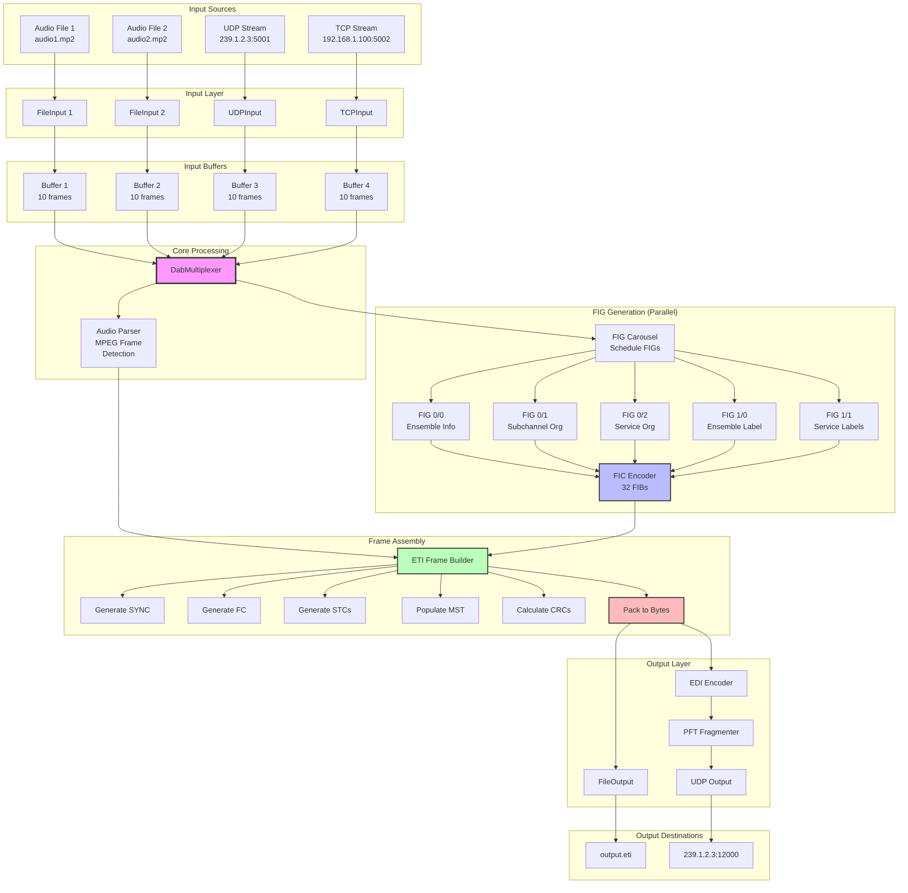

# Data Flow

Complete pipeline showing how data flows from inputs to outputs in python-dabmux.

## Complete Data Flow Diagram



## Detailed Flow Description

### Stage 1: Input Reading

**Purpose:** Read audio data from various sources into buffers

**Process:**
```
1. For each subchannel:
   a. Identify input type (file/UDP/TCP)
   b. Open input source
   c. Read audio frames
   d. Store in circular buffer
   e. Track buffer status (full/empty/underrun)
```

**Input Classes:**

- **FileInput**: Sequential file reading
  ```python
  def read(self, size: int) -> bytes:
      data = self.file.read(size)
      if len(data) < size:  # EOF
          if self.loop:
              self.file.seek(0)  # Loop
          else:
              data += b'\x00' * (size - len(data))  # Pad
      return data
  ```

- **UDPInput**: Non-blocking UDP receive
  ```python
  def read(self, size: int) -> bytes:
      data = b''
      while len(data) < size:
          packet = self.socket.recv(4096)
          data += packet
      return data[:size]
  ```

- **TCPInput**: Blocking TCP receive
  ```python
  def read(self, size: int) -> bytes:
      data = b''
      while len(data) < size:
          chunk = self.socket.recv(size - len(data))
          data += chunk
      return data
  ```

**Buffering:**
- Default: 10 frames per input
- Underrun detection: Log warning, fill with zeros
- Overrun detection: Drop oldest data

---

### Stage 2: Audio Parsing

**Purpose:** Parse MPEG frames and validate format

**Process:**
```
1. Scan for MPEG sync word (0xFFE, 0xFFF)
2. Parse frame header:
   - MPEG version (1 or 2)
   - Layer (II)
   - Bitrate
   - Sample rate
3. Validate frame size
4. Extract frame data
5. Update statistics
```

**MPEG Frame Structure:**
```
┌──────────────────────────────────────┐
│ Header (4 bytes)                     │
│  ├─ Sync (11 bits): 0xFFE           │
│  ├─ Version (2 bits): MPEG-1        │
│  ├─ Layer (2 bits): Layer II        │
│  ├─ Bitrate (4 bits)                │
│  ├─ Sample rate (2 bits)            │
│  └─ ...                              │
├──────────────────────────────────────┤
│ Audio Data (variable)                │
│  (depends on bitrate)                │
└──────────────────────────────────────┘
```

**Validation:**
```python
def parse_mpeg_frame(data: bytes) -> MpegFrame:
    # Check sync word
    if (data[0] & 0xFF) != 0xFF or (data[1] & 0xE0) != 0xE0:
        raise ValueError("Invalid MPEG sync")

    # Parse header bits
    version = (data[1] >> 3) & 0x03
    layer = (data[1] >> 1) & 0x03
    bitrate_idx = (data[2] >> 4) & 0x0F

    # Validate
    if layer != 0x02:  # Layer II
        raise ValueError(f"Expected Layer II, got {layer}")

    return MpegFrame(...)
```

---

### Stage 3: FIG Generation

**Purpose:** Generate Fast Information Groups describing the ensemble

**Process:**
```
1. Check FIG carousel timers
2. Select FIGs to include this frame
3. Generate each FIG:
   - FIG 0/0: Ensemble ID, ECC
   - FIG 0/1: Subchannel table
   - FIG 0/2: Service-component mapping
   - FIG 1/0: Ensemble label
   - FIG 1/1: Service labels
4. Encode FIGs into FIBs (Fast Information Blocks)
5. Calculate CRC-8 for each FIB
6. Pad with 0xFF if needed
```

**FIG Carousel Timing:**

| FIG Type | Repetition | Frames |
|----------|------------|--------|
| 0/0      | 96 ms      | Every 1 frame |
| 0/1      | ~1 sec     | Every 10 frames |
| 0/2      | ~1 sec     | Every 10 frames |
| 1/0      | ~1 sec     | Every 10 frames |
| 1/1      | ~1 sec     | Every 10 frames |
| Others   | ~10 sec    | Every 100 frames |

**FIG 0/0 Example (Ensemble Information):**
```
Byte 0: 0x00 (FIG type 0, extension 0)
Byte 1: 0xCE (Ensemble ID high byte)
Byte 2: 0x15 (Ensemble ID low byte)
Byte 3: 0xE1 (ECC)
...
```

**FIC Encoding:**
```
┌─────────────────────┐
│ FIB 0 (3 bytes)     │ ← FIG 0/0 data + CRC-8
├─────────────────────┤
│ FIB 1 (3 bytes)     │ ← FIG 0/1 data + CRC-8
├─────────────────────┤
│ ...                 │
├─────────────────────┤
│ FIB 31 (3 bytes)    │ ← Padding (0xFFFF) + CRC-8
└─────────────────────┘
  Total: 96 bytes
```

---

### Stage 4: Frame Assembly

**Purpose:** Combine all components into complete ETI frame

**Process:**
```
1. Create SYNC field (ERR + 0x073AB6)
2. Generate FC (Frame Characterization):
   - FCT (frame count)
   - NST (number of streams)
   - MID (mode ID)
3. Generate STC for each subchannel:
   - SCID (subchannel ID)
   - SAD (start address)
   - STL (stream length)
4. Calculate EOH CRC (FC + all STCs)
5. Insert FIC data (96 bytes)
6. Populate MST with audio data
7. Calculate EOF CRC (MST)
8. Add TIST if enabled
```

**Assembly Order:**
```python
def assemble_frame(self) -> EtiFrame:
    frame = EtiFrame()

    # 1. SYNC
    frame.sync.err = 0x00
    frame.sync.fsync = 0x073AB6

    # 2. FC
    frame.fc.fct = self.frame_count % 250
    frame.fc.nst = len(self.subchannels) - 1
    frame.fc.mid = 0x01  # Mode I

    # 3. STCs
    for i, subchan in enumerate(self.subchannels):
        stc = SubChannelStreamChar()
        stc.scid = subchan.id
        stc.sad = subchan.start_address
        stc.stl = calculate_stream_length(subchan)
        frame.stc.append(stc)

    # 4. EOH with CRC
    frame.eoh.crc = calculate_crc16(frame.fc, frame.stc)

    # 5. FIC
    frame.fic = self.fic_encoder.encode()

    # 6. MST
    frame.mst = self.populate_mst()

    # 7. EOF with CRC
    frame.eof.crc = calculate_crc16(frame.mst)

    # 8. TIST (optional)
    if self.enable_tist:
        frame.tist = self.calculate_tist()

    return frame
```

---

### Stage 5: Output Writing

**Purpose:** Serialize frame and write to destination

#### File Output

**Raw ETI:**
```python
def write(self, frame: EtiFrame) -> None:
    data = frame.pack()  # Serialize to bytes
    self.file.write(data)
```

**Framed ETI:**
```python
def write(self, frame: EtiFrame) -> None:
    data = frame.pack()
    # Add frame delimiter
    self.file.write(b'FR')
    self.file.write(struct.pack('>H', len(data)))
    self.file.write(data)
```

**Streamed ETI:**
```python
def write(self, frame: EtiFrame) -> None:
    data = frame.pack()
    # Add timestamp
    self.file.write(struct.pack('>Q', frame.tist or 0))
    self.file.write(data)
```

#### EDI Output

**Conversion to EDI:**
```
ETI Frame
  ↓
TAG Items (*ptr, deti, estN)
  ↓
AF Packet (8-byte aligned, CRC)
  ↓
PFT Fragmentation (optional)
  ↓
PF Fragments with FEC (optional)
  ↓
UDP/TCP Output
```

**EDI Encoding:**
```python
def encode_edi(self, frame: EtiFrame) -> bytes:
    # 1. Create TAG items
    tags = []
    tags.append(create_ptr_tag())       # Protocol tag
    tags.append(create_deti_tag(frame)) # ETI data
    for i, subchan in enumerate(frame.subchannels):
        tags.append(create_est_tag(i, subchan))

    # 2. Create AF packet
    af_packet = create_af_packet(tags)

    # 3. Optionally fragment with PFT
    if self.enable_pft:
        fragments = self.pft.fragment(af_packet)
        return fragments
    else:
        return af_packet
```

**PFT Fragmentation:**
```
Large AF Packet (e.g., 6000 bytes)
  ↓
Fragment 1 (1400 bytes)
Fragment 2 (1400 bytes)
Fragment 3 (1400 bytes)
Fragment 4 (1400 bytes)
Fragment 5 (1400 bytes)
  ↓
Add RS-FEC (2 parity fragments)
  ↓
Fragment 1, 2, 3, 4, 5, P1, P2
```

---

## Performance Characteristics

### Throughput

**Mode I (typical):**
- Frame rate: 10.42 frames/second
- Frame size: ~6000 bytes
- Throughput: ~62 KB/s (500 kbps)
- CPU: 10-20% of one core

### Latency

**End-to-end latency:**
```
Input read:       ~10 ms (buffering)
Audio parsing:    ~1 ms
FIG generation:   ~1 ms
Frame assembly:   ~2 ms
CRC calculation:  ~1 ms
Output write:     ~1 ms (file) or ~5 ms (network)
─────────────────────────
Total:            ~16-20 ms
```

### Memory Usage

**Per-frame memory:**
```
Input buffers:    ~60 KB (10 frames × 6 KB)
Frame structure:  ~6 KB
FIG cache:        ~2 KB
Output buffer:    ~6 KB
─────────────────────────
Total:            ~75 KB per active multiplex
```

---

## Data Transformations

### Input → MST

**Transformation:**
```
MPEG File (audio.mp2)
  ↓ [FileInput.read()]
Raw bytes
  ↓ [Audio parser]
MPEG frames
  ↓ [Extract payload]
Audio data
  ↓ [Populate MST]
Main Service Transport
```

### FIG → FIC

**Transformation:**
```
Ensemble Config
  ↓ [FIG generators]
FIG 0/0, 0/1, 0/2, 1/0, 1/1
  ↓ [FIG Carousel]
Selected FIGs for this frame
  ↓ [FIC Encoder]
32 FIBs (3 bytes each)
  ↓ [CRC-8]
96 bytes FIC
```

### ETI → EDI

**Transformation:**
```
ETI Frame
  ↓ [EDI Encoder]
TAG Items (*ptr, deti, estN)
  ↓ [AF Packet]
AF packet (aligned, CRC'd)
  ↓ [PFT Fragmenter]
PF fragments
  ↓ [RS-FEC]
PF fragments + parity
  ↓ [UDP Output]
Network packets
```

---

## Error Handling in Pipeline

### Input Stage

**Error:** File not found
**Action:** Raise FileNotFoundError at startup

**Error:** Network timeout
**Action:** Log warning, retry 3 times, then fail

**Error:** Invalid MPEG frame
**Action:** Log warning, skip frame, continue

### Processing Stage

**Error:** Capacity exceeded
**Action:** Raise ConfigurationError at startup

**Error:** Invalid FIG
**Action:** Log error, skip FIG, continue

### Output Stage

**Error:** Can't write file
**Action:** Raise IOError, stop multiplexer

**Error:** Network unreachable
**Action:** Log error, retry with exponential backoff

---

## Optimization Points

### Hot Paths

1. **MPEG frame parsing** (per frame, per subchannel)
2. **CRC calculation** (per frame, multiple times)
3. **FIG encoding** (per frame)
4. **Byte packing** (per frame)

### Optimizations

**Caching:**
- Cache FIG bytes (many don't change)
- Cache CRC tables
- Cache character set mappings

**Pre-allocation:**
- Reuse frame buffers
- Pre-allocate output buffers

**Batch operations:**
- Read multiple frames from inputs
- Write buffered output

---

## See Also

- [System Design](system-design.md): Overall architecture
- [ETI Frames](eti-frames.md): Frame structure details
- [FIG Carousel](fig-carousel.md): FIG scheduling
- [EDI Protocol](edi-protocol.md): Network output protocol
