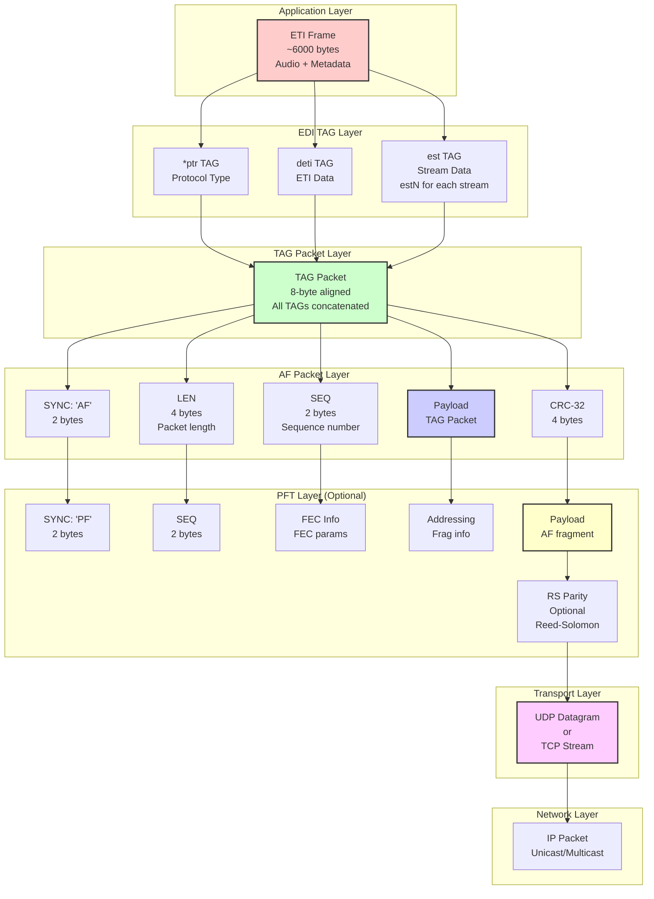

# EDI Protocol Stack

Layer-by-layer breakdown of the EDI (Ensemble Data Interface) protocol for transmitting ETI over IP networks.

## EDI Protocol Stack Diagram



## Protocol Layers Overview

### 1. Application Layer: ETI Frame

**Purpose:** Raw ETI data to be transmitted

**Contents:**
- Complete ETI frame (SYNC, FC, STC, FIC, MST, EOF, TIST)
- Size: Variable, typically ~6000 bytes for Mode I

**Example:**
```
ETI Frame (5604 bytes):
  SYNC (4) + FC (4) + STC (12) + EOH (4) +
  FIC (96) + MST (5472) + EOF (4) + TIST (4)
```

---

### 2. EDI TAG Layer

**Purpose:** Structure ETI data into TAG items

TAG items are TLV (Type-Length-Value) structures that encapsulate different parts of the ETI frame.

#### TAG Structure

```
┌──────┬──────┬──────────────┐
│ Name │ Len  │   Value      │
│ 4B   │ 4B   │  variable    │
└──────┴──────┴──────────────┘
```

**Fields:**
- **Name**: 4-character ASCII identifier
- **Length**: 32-bit big-endian length (of Value)
- **Value**: TAG-specific data

#### TAG Types

**\*ptr - Protocol Type and Revision**

```python
TAG Name: '*ptr'
Length: 4 bytes
Value:
  Byte 0-1: Protocol type ("TA", "ET", "ED")
  Byte 2-3: Revision (0x0001)
```

**Example:**
```
2A 70 74 72  # "*ptr"
00 00 00 04  # Length = 4
45 54 00 01  # "ET" + revision 0x0001
```

**deti - DAB ETI Data**

```python
TAG Name: 'deti'
Length: Variable (depends on frame)
Value:
  Complete ETI frame (all fields)
```

**Example:**
```
64 65 74 69  # "deti"
00 00 15 E4  # Length = 5604
[ETI frame bytes...]
```

**estN - Ensemble Stream Data (N = stream number)**

```python
TAG Name: 'est0', 'est1', 'est2', etc.
Length: Variable
Value:
  Audio/data for specific stream
```

**Example for stream 0:**
```
65 73 74 30  # "est0"
00 00 01 40  # Length = 320
[Stream 0 audio data...]
```

---

### 3. TAG Packet Layer

**Purpose:** Concatenate all TAGs into a single packet with 8-byte alignment

**Structure:**
```
┌─────────────────┐
│ *ptr TAG        │
├─────────────────┤
│ deti TAG        │
├─────────────────┤
│ est0 TAG        │
├─────────────────┤
│ est1 TAG        │
├─────────────────┤
│ ...             │
├─────────────────┤
│ Padding (align) │
└─────────────────┘
```

**Alignment:**
- Total packet size must be multiple of 8 bytes
- Pad with 0x00 bytes if needed

**Example:**
```python
def create_tag_packet(tags: List[bytes]) -> bytes:
    packet = b''.join(tags)

    # Align to 8 bytes
    padding = (8 - (len(packet) % 8)) % 8
    packet += b'\x00' * padding

    return packet
```

---

### 4. AF Packet Layer (Application Framing)

**Purpose:** Frame TAG packets with sync, length, sequence, and CRC

#### AF Packet Structure

```
┌──────────────────────┐
│ SYNC: "AF"  (2 bytes)│
├──────────────────────┤
│ LEN         (4 bytes)│  Length of entire AF packet
├──────────────────────┤
│ SEQ         (2 bytes)│  Sequence number
├──────────────────────┤
│ AR          (1 byte) │  Address type (0=unicast)
├──────────────────────┤
│ PT          (1 byte) │  Protocol type (0x02=TAG)
├──────────────────────┤
│ Payload   (variable) │  TAG Packet
├──────────────────────┤
│ CRC-32      (4 bytes)│  CRC of entire packet
└──────────────────────┘
```

#### Field Descriptions

**SYNC (2 bytes):**
- Fixed value: `0x4146` ("AF" in ASCII)
- Used for packet synchronization

**LEN (4 bytes, big-endian):**
- Total AF packet length including header and CRC
- Example: `0x000015F4` = 5620 bytes

**SEQ (2 bytes, big-endian):**
- Sequence number (0-65535, wraps)
- Increments for each AF packet
- Used to detect missing packets

**AR (1 byte):**
- Address type
- `0x00`: Not used (unicast)
- `0x01`: Multicast group address

**PT (1 byte):**
- Protocol type
- `0x02`: TAG packet (most common)

**Payload (variable):**
- TAG packet data (8-byte aligned)

**CRC-32 (4 bytes):**
- CRC-32 of entire AF packet (SYNC through Payload)
- Polynomial: 0x04C11DB7
- Initial: 0xFFFFFFFF
- Final XOR: 0xFFFFFFFF

#### AF Packet Creation

```python
def create_af_packet(tag_packet: bytes, seq: int) -> bytes:
    # Header
    sync = b'AF'
    ar = 0x00  # Not used
    pt = 0x02  # TAG packet

    # Length (will be calculated)
    payload = tag_packet
    total_len = 2 + 4 + 2 + 1 + 1 + len(payload) + 4

    # Assemble packet
    packet = bytearray()
    packet += sync
    packet += struct.pack('>I', total_len)  # LEN
    packet += struct.pack('>H', seq & 0xFFFF)  # SEQ
    packet += bytes([ar, pt])
    packet += payload

    # Calculate CRC-32
    crc = calculate_crc32(packet)
    packet += struct.pack('>I', crc)

    return bytes(packet)
```

---

### 5. PFT Layer (Protection, Fragmentation, Transport)

**Purpose:** Fragment large AF packets and add FEC for error recovery

#### When to Use PFT

**Use PFT when:**
- AF packet exceeds network MTU (~1500 bytes)
- Network is lossy (wireless, WAN)
- Error recovery needed (Reed-Solomon FEC)

**Skip PFT when:**
- AF packet fits in single UDP datagram
- Network is reliable (wired LAN)
- Low latency required

#### PFT Fragment Structure

```
┌──────────────────────┐
│ SYNC: "PF"  (2 bytes)│
├──────────────────────┤
│ PSEQ        (2 bytes)│  PFT sequence number
├──────────────────────┤
│ Findex      (3 bytes)│  Fragment index (24-bit)
├──────────────────────┤
│ Fcount      (3 bytes)│  Total fragments (24-bit)
├──────────────────────┤
│ FEC         (1 byte) │  FEC parameters
├──────────────────────┤
│ Addr        (1 byte) │  Addressing
├──────────────────────┤
│ Plen        (2 bytes)│  Payload length
├──────────────────────┤
│ RSk         (1 byte) │  RS data blocks
├──────────────────────┤
│ RSz         (1 byte) │  RS redundancy
├──────────────────────┤
│ Payload   (variable) │  AF fragment
├──────────────────────┤
│ RS Parity (optional) │  Reed-Solomon FEC
└──────────────────────┘
```

#### Field Descriptions

**SYNC (2 bytes):**
- Fixed value: `0x5046` ("PF" in ASCII)

**PSEQ (2 bytes):**
- PFT sequence number
- Increments for each AF packet (not per fragment)
- All fragments of same AF packet have same PSEQ

**Findex (3 bytes):**
- Fragment index (0-based)
- Which fragment this is (0, 1, 2, ...)

**Fcount (3 bytes):**
- Total number of fragments
- Includes data fragments + parity fragments

**FEC (1 byte):**
- Bit 7: FEC enabled (1=yes, 0=no)
- Bits 6-0: Reserved

**Addr (1 byte):**
- Addressing information

**Plen (2 bytes):**
- Payload length for this fragment

**RSk (1 byte):**
- Number of RS data blocks (k)
- Only if FEC enabled

**RSz (1 byte):**
- Number of RS parity blocks (m)
- Only if FEC enabled

**Payload (variable):**
- Fragment of AF packet

**RS Parity (optional):**
- Reed-Solomon parity data
- Only on parity fragments when FEC enabled

#### Fragmentation Algorithm

```python
def fragment_af_packet(af_packet: bytes, max_frag_size: int,
                       fec_enabled: bool, fec_m: int) -> List[bytes]:
    """
    Fragment AF packet into PFT fragments.

    Args:
        af_packet: Complete AF packet
        max_frag_size: Maximum fragment payload size
        fec_enabled: Enable Reed-Solomon FEC
        fec_m: Number of parity fragments (if FEC enabled)

    Returns:
        List of PFT fragments
    """
    # Calculate data fragments
    num_data_frags = (len(af_packet) + max_frag_size - 1) // max_frag_size

    # Total fragments (data + parity)
    if fec_enabled:
        num_total_frags = num_data_frags + fec_m
    else:
        num_total_frags = num_data_frags

    fragments = []
    pseq = get_next_pseq()

    # Create data fragments
    for i in range(num_data_frags):
        start = i * max_frag_size
        end = min(start + max_frag_size, len(af_packet))
        payload = af_packet[start:end]

        frag = create_pft_fragment(
            pseq=pseq,
            findex=i,
            fcount=num_total_frags,
            payload=payload,
            fec_enabled=fec_enabled,
            rsk=num_data_frags if fec_enabled else 0,
            rsz=fec_m if fec_enabled else 0
        )
        fragments.append(frag)

    # Create parity fragments (if FEC enabled)
    if fec_enabled:
        parity_data = calculate_rs_parity(af_packet, num_data_frags, fec_m)
        parity_frag_size = len(parity_data) // fec_m

        for i in range(fec_m):
            start = i * parity_frag_size
            end = start + parity_frag_size
            payload = parity_data[start:end]

            frag = create_pft_fragment(
                pseq=pseq,
                findex=num_data_frags + i,
                fcount=num_total_frags,
                payload=payload,
                fec_enabled=True,
                rsk=num_data_frags,
                rsz=fec_m
            )
            fragments.append(frag)

    return fragments
```

#### Reed-Solomon FEC

**Parameters:**
- **k**: Number of data fragments
- **m**: Number of parity fragments
- **n = k + m**: Total fragments

**Recovery capability:**
- Can recover up to **m** lost fragments
- Example: (k=5, m=2) → Can lose any 2 of 7 fragments

**RS(255, k) encoding:**
- Operates over GF(2^8) (Galois Field)
- Generator polynomial with roots at α^1, α^2, ..., α^(n-k)

**Example:**
```python
# Fragment AF packet (6000 bytes, 1400-byte fragments)
# → 5 data fragments (1400, 1400, 1400, 1400, 1400)

# Add 2 parity fragments with RS FEC
# → 7 total fragments

# Can lose any 2 fragments and still reconstruct:
# Lost fragments 2 and 4? Reconstruct from 1,3,5,P1,P2
```

---

### 6. Transport Layer: UDP/TCP

**UDP (User Datagram Protocol):**

**Use cases:**
- Low latency
- Multicast support
- Stateless

**Characteristics:**
- Connectionless
- No guaranteed delivery
- No ordering guarantee
- Suitable with PFT+FEC

**Example:**
```python
# Send PFT fragment over UDP
sock = socket.socket(socket.AF_INET, socket.SOCK_DGRAM)
sock.sendto(pft_fragment, (dest_ip, dest_port))
```

**TCP (Transmission Control Protocol):**

**Use cases:**
- Reliable delivery required
- Unicast only
- Stateful connection

**Characteristics:**
- Connection-oriented
- Guaranteed delivery
- In-order delivery
- PFT optional (less needed)

**Example:**
```python
# Send AF packet over TCP
sock = socket.socket(socket.AF_INET, socket.SOCK_STREAM)
sock.connect((dest_ip, dest_port))
sock.sendall(af_packet)
```

---

### 7. Network Layer: IP

**IPv4:**
- Unicast: Point-to-point
- Multicast: 224.0.0.0 - 239.255.255.255

**IPv6:**
- Unicast: Point-to-point
- Multicast: ff00::/8

**Multicast routing:**
- IGMP (IPv4) or MLD (IPv6)
- Router configuration required
- Efficient for one-to-many transmission

---

## Complete Example

### Sending ETI over EDI with PFT

```python
# 1. Start with ETI frame
eti_frame = generate_eti_frame()  # 5604 bytes

# 2. Create TAG items
ptr_tag = create_ptr_tag()           # 12 bytes
deti_tag = create_deti_tag(eti_frame)  # 5612 bytes
est0_tag = create_est_tag(0, stream0_data)  # Variable

# 3. Create TAG packet (8-byte aligned)
tags = [ptr_tag, deti_tag, est0_tag]
tag_packet = create_tag_packet(tags)  # ~6000 bytes

# 4. Create AF packet
af_packet = create_af_packet(tag_packet, seq=123)  # ~6014 bytes

# 5. Fragment with PFT (if needed)
if enable_pft:
    fragments = fragment_af_packet(
        af_packet,
        max_frag_size=1400,
        fec_enabled=True,
        fec_m=2
    )  # 7 fragments (5 data + 2 parity)

    # 6. Send each fragment over UDP
    for frag in fragments:
        sock.sendto(frag, (dest_ip, dest_port))
else:
    # Send AF packet directly (if it fits)
    sock.sendto(af_packet, (dest_ip, dest_port))
```

---

## Bandwidth Calculation

### Without PFT

```
ETI frame:    5604 bytes
TAG overhead: ~50 bytes (headers)
AF overhead:  14 bytes (header + CRC)
─────────────────────────
Total:        ~5668 bytes per frame

Mode I: 10.42 frames/second
Bandwidth: 5668 × 10.42 = 59 KB/s ≈ 472 kbps
```

### With PFT (5 data + 2 parity fragments)

```
AF packet:    5668 bytes
Fragmented:   5 × 1400 = 7000 bytes (padded)
PFT overhead: 7 × 16 = 112 bytes (headers)
RS parity:    2 × 1400 = 2800 bytes
─────────────────────────
Total:        9912 bytes per frame

Mode I: 10.42 frames/second
Bandwidth: 9912 × 10.42 = 103 KB/s ≈ 824 kbps
```

---

## See Also

- [System Design](system-design.md): Overall architecture
- [Data Flow](data-flow.md): EDI output in pipeline
- [PFT Fragmentation](../user-guide/outputs/pft-fragmentation.md): User guide for PFT
- [Reed-Solomon FEC](../advanced/reed-solomon.md): FEC mathematics
