# ETI Frame Structure

Detailed byte-level layout of ETI (Ensemble Transport Interface) frames.

## Frame Layout Diagram

```mermaid
graph TD
    subgraph "ETI Frame Structure"
        SYNC["SYNC (4 bytes)<br/>ERR + FSYNC"]
        FC["FC (4 bytes)<br/>Frame Characterization"]
        STC["STC (4×N bytes)<br/>Stream Characterization<br/>(N = subchannels)"]
        EOH["EOH (4 bytes)<br/>End of Header + CRC"]
        FIC["FIC (96 bytes Mode I)<br/>Fast Information Channel<br/>(32 FIBs × 3 bytes)"]
        MST["MST (variable)<br/>Main Service Transport<br/>(Audio/Data)"]
        EOF["EOF (4 bytes)<br/>End of Frame + CRC"]
        TIST["TIST (4 bytes, optional)<br/>Time Stamp"]
    end

    SYNC --> FC
    FC --> STC
    STC --> EOH
    EOH --> FIC
    FIC --> MST
    MST --> EOF
    EOF --> TIST

    style SYNC fill:#ffcccc
    style FC fill:#ccffcc
    style STC fill:#ccccff
    style EOH fill:#ffffcc
    style FIC fill:#ffccff
    style MST fill:#ccffff
    style EOF fill:#ffdddd
    style TIST fill:#ddffdd
```



## Complete Frame Structure

**Total size:** Variable, typically ~6000 bytes for Mode I

```
Byte Offset | Field | Size | Description
------------|-------|------|-------------
0           | SYNC  | 4    | Synchronization
4           | FC    | 4    | Frame Characterization
8           | STC   | 4×N  | Sub-channel Stream Characterization (N channels)
8+4N        | EOH   | 4    | End of Header (with CRC)
12+4N       | FIC   | 96   | Fast Information Channel (Mode I)
108+4N      | MST   | var  | Main Service Transport
108+4N+M    | EOF   | 4    | End of Frame (with CRC)
112+4N+M    | TIST  | 4    | Time Stamp (optional)
```

Where:
- **N** = number of subchannels (0-64)
- **M** = MST length in bytes (depends on subchannels and mode)

---

## Field Descriptions

### SYNC (4 bytes)

**Purpose:** Frame synchronization and error indication

**Structure:**
```
Byte 0: ERR (Error indicator)
Byte 1-3: FSYNC = 0x073AB6 (fixed sync pattern)
```

**ERR byte bits:**
```
Bit 7: Frame synchronization error
Bit 6: FIC CRC error
Bit 5-0: Reserved (0)
```

**Example:**
```
00 07 3A B6
│  └──┴──┴─ FSYNC (0x073AB6)
└─ ERR = 0x00 (no errors)
```

---

### FC (Frame Characterization, 4 bytes)

**Purpose:** Describes frame structure and timing

**Bit layout:**
```
Bits 31-24: FCT (Frame Count, 0-249)
Bits 23-22: FICF (FIC Flag, always 1 for DAB)
Bits 21-20: NST (Number of Streams, N-1)
Bits 19-17: FP (Frame Phase, 0-7)
Bits 16-14: MID (Mode Identity: 001=I, 010=II, 011=III, 100=IV)
Bits 13-11: FL (Frame Length in 24ms units)
Bits 10-0: Reserved
```

**Example for Mode I, 2 subchannels:**
```
C8 14 00 00
│  │  └──┴─ Reserved
│  └─ NST=1 (2 streams), FP=0, MID=001 (Mode I)
└─ FCT=200 (frame count)
```

**Frame Count (FCT):**
- Increments from 0 to 249
- Wraps to 0 after 249
- Used for frame sequencing
- Period: 250 frames = 24 seconds (Mode I)

---

### STC (Sub-channel Stream Characterization, 4 bytes each)

**Purpose:** Describes each subchannel's characteristics

**One STC per subchannel**, in order of subchannel ID.

**Bit layout:**
```
Bits 31-26: SCID (Sub-Channel ID, 0-63)
Bits 25-16: SAD (Start Address in CUs)
Bits 15-14: TPL (Time Position Location, 00=MSC)
Bits 13-8: STL (Stream Length in units of 64 bits)
Bits 7-0: Reserved
```

**Example:**
```
00 00 05 40
│  │  │  └─ Reserved
│  │  └─ STL=5 (5×64 bits = 320 bits = 40 bytes)
│  └─ SAD=0 (start address 0)
└─ SCID=0 (subchannel 0)
```

**Stream Length (STL):**
- In units of 64 bits (8 bytes)
- `Length in bytes = STL × 8`
- Includes all data for this subchannel in MST

---

### EOH (End of Header, 4 bytes)

**Purpose:** Marks end of header and provides CRC

**Structure:**
```
Bytes 0-1: CRC-16-CCITT of FC + all STCs
Bytes 2-3: Reserved (usually 0xFFFF)
```

**CRC Calculation:**
```python
# CRC-16-CCITT (polynomial 0x1021, init 0xFFFF)
crc = crc16(fc_bytes + all_stc_bytes)
```

**Example:**
```
E3 8F FF FF
│  │  └──┴─ Reserved
└──┴─ CRC = 0xE38F
```

---

### FIC (Fast Information Channel, 96 bytes for Mode I)

**Purpose:** Carries FIG (Fast Information Group) metadata

**Structure:**
- **32 FIBs** (Fast Information Blocks) of **3 bytes** each
- Each FIB can contain multiple FIGs
- Ends with padding (0xFF) if FIGs don't fill all FIBs

**FIB Format:**
```
Byte 0-1: FIG data or 0xFFFF (padding)
Byte 2: CRC-8 of bytes 0-1
```

**Example FIC (first 12 bytes):**
```
21 02 CE 15 00 E1 ... (FIG 0/0 data)
C0 80 50 01 ...       (FIG 0/2 data)
...
FF FF 00              (Padding FIB)
```

**FIG types commonly in FIC:**
- FIG 0/0: Ensemble information
- FIG 0/1: Sub-channel organization
- FIG 0/2: Service organization
- FIG 1/0: Ensemble label
- FIG 1/1: Service labels

---

### MST (Main Service Transport, variable size)

**Purpose:** Carries audio/data for all subchannels

**Structure:**
- Concatenated audio/data streams
- Each stream occupies `STL × 8` bytes
- Streams in order of subchannel ID

**Example with 2 subchannels:**
```
┌─────────────────────────┐
│ Subchannel 0 data       │ (STL₀ × 8 bytes)
│ (MPEG audio frames)     │
├─────────────────────────┤
│ Subchannel 1 data       │ (STL₁ × 8 bytes)
│ (MPEG audio frames)     │
└─────────────────────────┘
```

**Mode I MST size:**
- **864 Capacity Units** available
- 1 CU = 8 bits (in Mode I)
- Total: 864 bytes raw capacity
- Actual size depends on subchannel bitrates and protection

**Data alignment:**
- Each subchannel's data is byte-aligned
- No padding between subchannels

---

### EOF (End of Frame, 4 bytes)

**Purpose:** Marks end of frame and provides CRC

**Structure:**
```
Bytes 0-1: CRC-16-CCITT of MST
Bytes 2-3: Reserved (usually 0xFFFF)
```

**CRC Calculation:**
```python
# CRC-16-CCITT of entire MST
crc = crc16(mst_bytes)
```

**Example:**
```
7A 2B FF FF
│  │  └──┴─ Reserved
└──┴─ CRC = 0x7A2B
```

---

### TIST (Time Stamp, 4 bytes, optional)

**Purpose:** Provides precise frame timing for synchronized transmission

**Structure:**
```
32-bit unsigned integer
Milliseconds since EDI epoch (2000-01-01 00:00:00 UTC)
```

**Calculation:**
```python
edi_epoch = datetime(2000, 1, 1, 0, 0, 0, tzinfo=timezone.utc)
now = datetime.now(timezone.utc)
tist_ms = int((now - edi_epoch).total_seconds() * 1000)
```

**Example:**
```
5A 3C 1F 80
└──┴──┴──┴─ TIST = 0x5A3C1F80 (1514135424 ms)
           = ~48 years after 2000
           = ~2048-01-01
```

**Use cases:**
- Single Frequency Networks (SFN) synchronization
- Timed playout
- Multi-transmitter coordination

---

## Frame Size Calculation

### Mode I Frame Size

**Formula:**
```
Size = 12 + 4×N + 96 + MST_size + 4 + (4 if TIST)

Where:
  N = number of subchannels
  MST_size = sum of (STL × 8) for all subchannels
```

**Example with 3 subchannels (128 kbps each, protection level 2):**
```
SYNC:  4 bytes
FC:    4 bytes
STC:   12 bytes (3 × 4)
EOH:   4 bytes
FIC:   96 bytes
MST:   5472 bytes (calculated from bitrates)
EOF:   4 bytes
TIST:  4 bytes (optional)
─────────────────
Total: 5600 bytes (without TIST)
       5604 bytes (with TIST)
```

### MST Size Calculation

**For Mode I:**

1. Calculate **required bitrate** including protection overhead
2. Convert to **Capacity Units (CUs)**
3. Convert CUs to bytes: `bytes = CUs` (in Mode I, 1 CU = 8 bits)

**Protection overhead:**
- Depends on protection level and form (short/long)
- Higher protection = more CUs needed

---

## Hexdump Example

**Minimal Mode I frame (1 subchannel, 128 kbps):**

```
Offset   Hex                                          ASCII
000000   00 07 3a b6 c8 14 00 00 00 00 05 40 e3 8f   ..:.........@..
         └─SYNC─┘ └───FC──┘ └───STC──┘ └──EOH─┘

000010   ff ff 21 02 ce 15 00 e1 c0 80 50 01 00 00   ..!.......P...
         └FIC (96 bytes)────────────────────────...

000070   ...                                          ...
         └─────────────────────────────────────────

0015b0   [MST data continues]                         ...

0015c0   7a 2b ff ff 5a 3c 1f 80                      z+..Z<..
         └──EOF──┘ └──TIST─┘
```

---

## CRC Polynomials

### CRC-16-CCITT

**Used for:** EOH, EOF

**Polynomial:** `0x1021`
**Initial value:** `0xFFFF`
**Final XOR:** `0xFFFF`

```python
def crc16(data: bytes) -> int:
    crc = 0xFFFF
    for byte in data:
        crc ^= (byte << 8)
        for _ in range(8):
            if crc & 0x8000:
                crc = (crc << 1) ^ 0x1021
            else:
                crc = crc << 1
            crc &= 0xFFFF
    return crc ^ 0xFFFF
```

### CRC-8

**Used for:** FIB checksums in FIC

**Polynomial:** `0x1D`
**Initial value:** `0xFF`
**Final XOR:** `0x00`

```python
def crc8(data: bytes) -> int:
    crc = 0xFF
    for byte in data:
        crc ^= byte
        for _ in range(8):
            if crc & 0x80:
                crc = (crc << 1) ^ 0x1D
            else:
                crc = crc << 1
            crc &= 0xFF
    return crc
```

---

## Frame Timing

### Mode I

- **Frame duration:** 96 ms
- **Frame rate:** 10.41667 frames/second
- **FCT period:** 250 frames = 24 seconds

### Other Modes

| Mode | Duration | Rate (fps) | FCT Period |
|------|----------|------------|------------|
| I    | 96 ms    | 10.42      | 24 s       |
| II   | 24 ms    | 41.67      | 6 s        |
| III  | 24 ms    | 41.67      | 6 s        |
| IV   | 48 ms    | 20.83      | 12 s       |

---

## Validation

### Sanity Checks

1. **SYNC pattern:** Must be `0x073AB6`
2. **FCT range:** 0-249
3. **MID validity:** 001, 010, 011, or 100
4. **NST consistency:** Must match number of STCs
5. **CRC validity:** EOH and EOF CRCs must be correct
6. **FIC size:** Must be 96 bytes for Mode I
7. **MST size:** Must match sum of STL values

### python-dabmux Validation

```python
def validate_frame(frame: EtiFrame) -> bool:
    # Check sync
    if frame.sync.fsync != 0x073AB6:
        return False

    # Check FCT range
    if frame.fc.fct > 249:
        return False

    # Validate CRCs
    if not frame.validate_eoh_crc():
        return False
    if not frame.validate_eof_crc():
        return False

    return True
```

---

## See Also

- [System Design](system-design.md): Overall architecture
- [Data Flow](data-flow.md): How frames are generated
- [FIG Carousel](fig-carousel.md): FIG generation for FIC
- [ETSI EN 300 799](https://www.etsi.org/deliver/etsi_en/300700_300799/300799/): ETI specification
