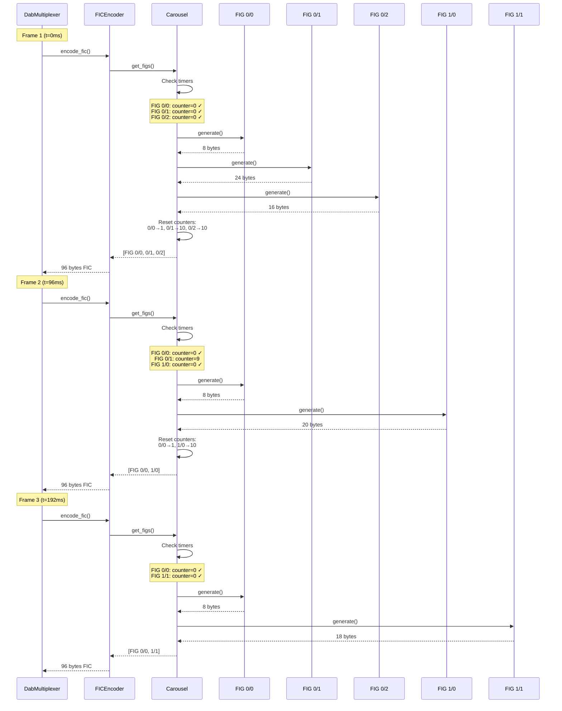

# FIG Carousel Operation

How the FIG (Fast Information Group) carousel rotates through different FIG types based on their repetition rates.

## FIG Carousel Sequence Diagram



## FIG Carousel Timing Diagram

```mermaid
gantt
    title FIG Repetition Schedule
    dateFormat X
    axisFormat %L ms

    section FIG 0/0
    Frame 1   :0, 96
    Frame 2   :96, 96
    Frame 3   :192, 96
    Frame 4   :288, 96
    Frame 5   :384, 96

    section FIG 0/1
    Frame 1   :0, 96
    Frame 11  :960, 96
    Frame 21  :1920, 96

    section FIG 0/2
    Frame 1   :0, 96
    Frame 11  :960, 96
    Frame 21  :1920, 96

    section FIG 1/0
    Frame 2   :96, 96
    Frame 12  :1056, 96
    Frame 22  :2016, 96

    section FIG 1/1
    Frame 3   :192, 96
    Frame 13  :1152, 96
    Frame 23  :2112, 96
```



## Overview

The **FIG Carousel** is a scheduling system that determines which FIGs (Fast Information Groups) are included in each frame. Different FIG types have different repetition rates based on their importance and how often receivers need to see them.

**Key concepts:**

- **FIG Priority**: Critical FIGs repeat more frequently
- **Timers**: Each FIG has a countdown timer
- **Buffer Management**: FIGs must fit in 96-byte FIC
- **Round-Robin**: FIGs rotate in a predictable pattern

---

## FIG Types and Repetition Rates

### High Priority (Every Frame)

**FIG 0/0 - Ensemble Information**

- **Repetition**: 96 ms (every 1 frame in Mode I)
- **Purpose**: Ensemble ID, country code, alarm flag
- **Size**: 6-8 bytes
- **Why frequent**: Receivers need this to identify the ensemble immediately

**Example:**
```python
class Fig0_0:
    def __init__(self):
        self.repetition_ms = 96  # Every frame
        self.counter = 1
```

### Medium Priority (Every ~1 Second)

**FIG 0/1 - Sub-channel Organization**

- **Repetition**: ~1 second (~10 frames in Mode I)
- **Purpose**: Subchannel IDs, start addresses, sizes
- **Size**: 4 bytes per subchannel + header
- **Why frequent**: Needed to find audio data in MST

**FIG 0/2 - Service Organization**

- **Repetition**: ~1 second (~10 frames)
- **Purpose**: Links services to components
- **Size**: 3-4 bytes per service + header
- **Why frequent**: Needed to map service names to audio

**FIG 1/0 - Ensemble Label**

- **Repetition**: ~1 second (~10 frames)
- **Purpose**: Ensemble name (text label)
- **Size**: 16-20 bytes
- **Why frequent**: Displayed prominently on receivers

**FIG 1/1 - Service Labels**

- **Repetition**: ~1 second (~10 frames)
- **Purpose**: Service names (station labels)
- **Size**: 16-20 bytes per service
- **Why frequent**: Displayed in station lists

### Low Priority (Every 10+ Seconds)

**FIG 0/5 - Service Component Language**

- **Repetition**: 10 seconds (~100 frames)
- **Purpose**: Language codes for components
- **Size**: 2-3 bytes per component

**FIG 0/8 - Service Component Global Definition**

- **Repetition**: 10 seconds
- **Purpose**: Global service IDs
- **Size**: Variable

**FIG 0/13 - User Application Information**

- **Repetition**: 10 seconds
- **Purpose**: EPG, slideshow, etc.
- **Size**: Variable

**FIG 0/17 - Programme Type**

- **Repetition**: 10 seconds
- **Purpose**: Programme type codes
- **Size**: 2-3 bytes per service

---

## Carousel Algorithm

### Initialization

```python
class FigCarousel:
    def __init__(self, ensemble: DabEnsemble):
        self.ensemble = ensemble
        self.fig_generators = {
            '0/0': Fig0_0(ensemble),
            '0/1': Fig0_1(ensemble),
            '0/2': Fig0_2(ensemble),
            '1/0': Fig1_0(ensemble),
            '1/1': Fig1_1(ensemble),
            # ... more FIG types
        }

        # Initialize counters (in frames)
        self.counters = {
            '0/0': 1,    # Every frame
            '0/1': 10,   # Every ~1 second
            '0/2': 10,
            '1/0': 10,
            '1/1': 10,
            '0/5': 100,  # Every ~10 seconds
            '0/8': 100,
            '0/13': 100,
            '0/17': 100,
        }
```

### Frame-by-Frame Operation

```python
def get_figs_for_frame(self) -> List[bytes]:
    """
    Get FIGs to include in this frame.

    Returns:
        List of FIG byte arrays
    """
    figs = []
    total_size = 0
    max_size = 90  # Leave room for padding and CRC

    # Priority order
    fig_order = ['0/0', '0/1', '0/2', '1/0', '1/1', '0/5', '0/8', '0/13', '0/17']

    for fig_type in fig_order:
        # Check if this FIG should be included
        if self.counters[fig_type] <= 0:
            # Generate FIG
            fig_data = self.fig_generators[fig_type].generate()

            # Check if it fits
            if total_size + len(fig_data) <= max_size:
                figs.append(fig_data)
                total_size += len(fig_data)

                # Reset counter based on repetition rate
                self.counters[fig_type] = self._get_repetition(fig_type)
            else:
                # Doesn't fit, defer to next frame
                break
        else:
            # Not yet time for this FIG
            pass

    # Decrement all counters
    for fig_type in self.counters:
        self.counters[fig_type] -= 1

    return figs
```

### Repetition Rate Calculation

```python
def _get_repetition(self, fig_type: str) -> int:
    """
    Get repetition interval in frames.

    For Mode I: 96ms per frame, so:
    - Every frame = 1
    - Every ~1 second = 10 frames
    - Every ~10 seconds = 100 frames
    """
    repetition_map = {
        '0/0': 1,     # 96 ms
        '0/1': 10,    # ~960 ms
        '0/2': 10,
        '1/0': 10,
        '1/1': 10,
        '0/5': 100,   # ~9.6 seconds
        '0/8': 100,
        '0/13': 100,
        '0/17': 100,
    }
    return repetition_map.get(fig_type, 10)
```

---

## FIC Encoding

### FIB Structure

The **FIC (Fast Information Channel)** is encoded as **32 FIBs** (Fast Information Blocks):

```
FIB = Fast Information Block (3 bytes)
  Byte 0-1: Data (or 0xFFFF for padding)
  Byte 2: CRC-8 of bytes 0-1
```

**Total FIC size:** 32 FIBs × 3 bytes = 96 bytes

### Encoding Process

```python
def encode_fic(self, figs: List[bytes]) -> bytes:
    """
    Encode FIGs into 96-byte FIC.

    Args:
        figs: List of FIG byte arrays

    Returns:
        96-byte FIC data
    """
    fic_buffer = bytearray(96)
    pos = 0

    # Pack FIGs into FIBs
    for fig in figs:
        # Each FIG goes into FIBs
        fig_len = len(fig)

        for i in range(0, fig_len, 2):
            if pos >= 96:
                break  # FIC full

            # Get 2 bytes of data
            if i + 1 < fig_len:
                data = fig[i:i+2]
            else:
                # Last byte, pad with 0xFF
                data = fig[i:i+1] + b'\xFF'

            # Calculate CRC-8
            crc = self.calculate_crc8(data)

            # Write FIB
            fic_buffer[pos:pos+2] = data
            fic_buffer[pos+2] = crc
            pos += 3

    # Pad remaining FIBs
    while pos < 96:
        fic_buffer[pos:pos+2] = b'\xFF\xFF'
        fic_buffer[pos+2] = self.calculate_crc8(b'\xFF\xFF')
        pos += 3

    return bytes(fic_buffer)
```

### CRC-8 Calculation

```python
def calculate_crc8(self, data: bytes) -> int:
    """
    Calculate CRC-8 for FIB.

    Polynomial: 0x1D (x^8 + x^4 + x^3 + x^2 + 1)
    Initial: 0xFF
    Final XOR: 0x00
    """
    crc = 0xFF
    for byte in data:
        crc ^= byte
        for _ in range(8):
            if crc & 0x80:
                crc = (crc << 1) ^ 0x1D
            else:
                crc = crc << 1
            crc &= 0xFF
    return crc
```

---

## Example Frame Sequences

### Frame 1 (t=0ms)

**Counters:**
- FIG 0/0: 0 ✓ (include)
- FIG 0/1: 0 ✓ (include)
- FIG 0/2: 0 ✓ (include)
- FIG 1/0: 5
- FIG 1/1: 7

**FIGs included:**
- FIG 0/0: 8 bytes (Ensemble info)
- FIG 0/1: 24 bytes (3 subchannels)
- FIG 0/2: 16 bytes (3 services)

**Total:** 48 bytes (fits easily in 90-byte limit)

**Counter reset:**
- FIG 0/0: 1
- FIG 0/1: 10
- FIG 0/2: 10

---

### Frame 2 (t=96ms)

**Counters:**
- FIG 0/0: 0 ✓ (include)
- FIG 0/1: 9
- FIG 0/2: 9
- FIG 1/0: 4
- FIG 1/1: 6

**FIGs included:**
- FIG 0/0: 8 bytes

**Total:** 8 bytes

**Counter reset:**
- FIG 0/0: 1

---

### Frame 10 (t=864ms)

**Counters:**
- FIG 0/0: 0 ✓ (include)
- FIG 0/1: 1
- FIG 0/2: 1
- FIG 1/0: 0 ✓ (include)
- FIG 1/1: 0 ✓ (include)

**FIGs included:**
- FIG 0/0: 8 bytes
- FIG 1/0: 20 bytes (Ensemble label)
- FIG 1/1: 60 bytes (3 service labels)

**Total:** 88 bytes (fits in 90-byte limit)

**Counter reset:**
- FIG 0/0: 1
- FIG 1/0: 10
- FIG 1/1: 10

---

## Buffer Management

### Size Constraints

**FIC capacity:** 96 bytes total

**Usable for FIGs:**
- 32 FIBs × 3 bytes = 96 bytes
- CRC overhead: 1 byte per FIB = 32 bytes
- **Net data capacity:** ~90 bytes per frame

### Priority Handling

When FIGs don't fit:

1. **Always include FIG 0/0** (8 bytes, critical)
2. **Add other FIGs by priority** until buffer full
3. **Defer low-priority FIGs** to next frame
4. **Never split a FIG** across frames

**Example overflow:**
```python
# Frame has 90 bytes available
# FIG 0/0: 8 bytes (included, 82 left)
# FIG 0/1: 24 bytes (included, 58 left)
# FIG 0/2: 16 bytes (included, 42 left)
# FIG 1/1: 60 bytes (doesn't fit, defer)
```

### Padding

If FIGs don't fill FIC:

```python
# FIGs total: 48 bytes
# FIC size: 96 bytes
# Padding needed: 48 bytes

# Fill with 0xFFFF FIBs:
while pos < 96:
    fib = b'\xFF\xFF' + crc8(b'\xFF\xFF')
    fic_buffer[pos:pos+3] = fib
    pos += 3
```

---

## Performance Optimization

### Caching

**Problem:** Many FIGs don't change frame-to-frame

**Solution:** Cache generated FIG bytes

```python
class FigCarousel:
    def __init__(self):
        self.fig_cache = {}
        self.cache_valid = {}

    def get_fig(self, fig_type: str) -> bytes:
        # Check cache
        if self.cache_valid.get(fig_type, False):
            return self.fig_cache[fig_type]

        # Generate and cache
        fig_data = self.fig_generators[fig_type].generate()
        self.fig_cache[fig_type] = fig_data
        self.cache_valid[fig_type] = True

        return fig_data

    def invalidate_cache(self, fig_type: str):
        """Invalidate cache when ensemble config changes"""
        self.cache_valid[fig_type] = False
```

**Cache invalidation:**
- Service added/removed → Invalidate FIG 0/2, 1/1
- Subchannel changed → Invalidate FIG 0/1
- Label changed → Invalidate FIG 1/0 or 1/1

### Pre-computation

**Pre-compute static FIGs at startup:**

```python
class FigCarousel:
    def __init__(self, ensemble: DabEnsemble):
        # Generate all FIGs once
        self._precompute_figs()

    def _precompute_figs(self):
        for fig_type in self.fig_generators:
            self.get_fig(fig_type)  # Populate cache
```

---

## Debugging

### FIG Carousel State

```python
def debug_state(self) -> str:
    """Print carousel state for debugging"""
    lines = ["FIG Carousel State:"]
    for fig_type, counter in self.counters.items():
        status = "DUE" if counter <= 0 else f"in {counter} frames"
        lines.append(f"  {fig_type}: {status}")
    return "\n".join(lines)
```

**Example output:**
```
FIG Carousel State:
  0/0: DUE
  0/1: in 5 frames
  0/2: in 5 frames
  1/0: in 2 frames
  1/1: in 8 frames
  0/5: in 87 frames
```

### FIG Content Inspection

```python
def inspect_fig(self, fig_data: bytes) -> str:
    """Inspect FIG contents"""
    fig_type = (fig_data[0] >> 5) & 0x07
    extension = fig_data[0] & 0x1F

    return f"FIG {fig_type}/{extension}: {len(fig_data)} bytes"
```

---

## See Also

- [System Design](system-design.md): Overall architecture
- [ETI Frames](eti-frames.md): Where FIC fits in frames
- [Data Flow](data-flow.md): FIG generation in pipeline
- [FIG Types](../advanced/fig-types.md): Complete FIG specifications
