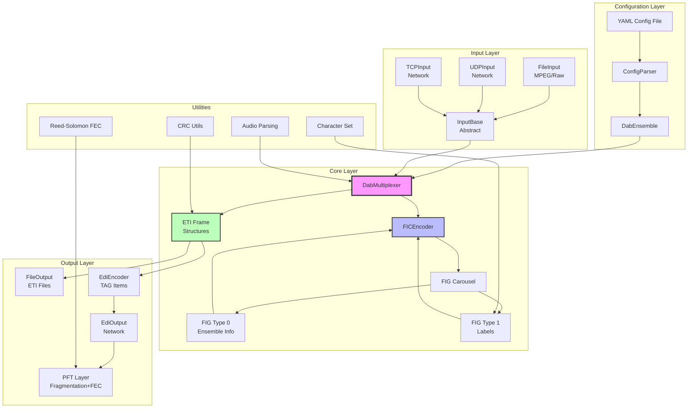
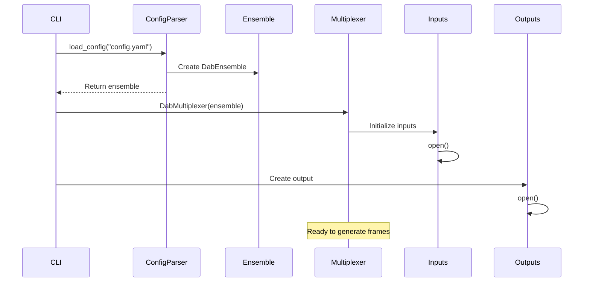
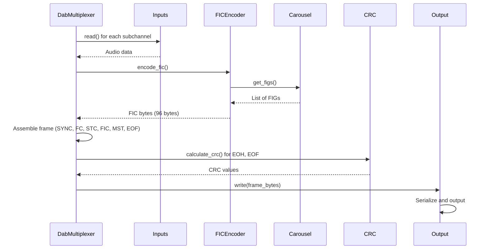

# System Design

High-level architecture of python-dabmux showing module structure and data flow.

## Architecture Diagram



## Layer Descriptions

### Configuration Layer

**Purpose:** Parse YAML configuration and create ensemble structure

**Components:**

- **ConfigParser**: Reads YAML files and creates DabEnsemble
- **DabEnsemble**: Container for all ensemble data (services, subchannels, components)

**Data Flow:**
```
YAML file → ConfigParser → DabEnsemble → DabMultiplexer
```

**Key Responsibilities:**

- YAML parsing and validation
- ID type conversion (hex strings to integers)
- Label validation
- Ensemble structure creation

---

### Input Layer

**Purpose:** Abstract audio input sources (files and network)

**Components:**

- **InputBase**: Abstract base class defining input interface
- **FileInput**: Read MPEG Layer II files
- **UDPInput**: Receive audio over UDP (unicast/multicast)
- **TCPInput**: Receive audio over TCP

**Data Flow:**
```
Audio Source → Input Class → Buffer → DabMultiplexer
```

**Key Responsibilities:**

- Open/close input sources
- Read audio frames
- Buffer management
- Format validation
- Statistics tracking

**Interface:**
```python
class InputBase(ABC):
    def open(self) -> None: ...
    def read(self, size: int) -> bytes: ...
    def close(self) -> None: ...
    def get_stats(self) -> Dict: ...
```

---

### Core Layer

**Purpose:** Multiplex audio streams and generate FIG metadata

**Components:**

- **DabMultiplexer**: Main orchestrator, generates ETI frames
- **FICEncoder**: Encodes Fast Information Channel
- **FIG Carousel**: Schedules FIG repetition
- **FIG Type 0**: Ensemble information FIGs
- **FIG Type 1**: Label FIGs
- **ETI Structures**: Frame data structures

**Data Flow:**
```
┌─────────────────┐
│ DabMultiplexer  │
├─────────────────┤
│ 1. Read inputs  │
│ 2. Generate FIGs│
│ 3. Encode FIC   │
│ 4. Populate MST │
│ 5. Calculate CRC│
│ 6. Pack frame   │
└─────────────────┘
```

**Key Responsibilities:**

- Frame timing and sequencing
- FIG generation and carousel management
- Audio data multiplexing
- CRC calculation
- Frame assembly

**Main Algorithm:**
```python
def generate_frame(self) -> EtiFrame:
    # 1. Read audio from all inputs
    audio_data = self._read_inputs()

    # 2. Generate FIGs for this frame
    figs = self.carousel.get_figs_for_frame()

    # 3. Encode FIC
    fic_data = self.fic_encoder.encode(figs)

    # 4. Create frame
    frame = EtiFrame()
    frame.fic = fic_data
    frame.mst = audio_data

    # 5. Calculate CRCs
    frame.calculate_crcs()

    return frame
```

---

### Output Layer

**Purpose:** Write ETI frames to files or send over network

**Components:**

- **FileOutput**: Write ETI to files (raw/streamed/framed)
- **EdiOutput**: Send EDI over network (UDP/TCP)
- **EdiEncoder**: Convert ETI to EDI TAG items
- **PFT Layer**: Fragmentation and FEC for EDI

**Data Flow:**

**File Output:**
```
ETI Frame → Serialize → FileOutput → File
```

**EDI Output:**
```
ETI Frame → EdiEncoder → TAG Items → AF Packet → PFT → UDP/TCP
```

**Key Responsibilities:**

- ETI serialization
- File format handling (raw/streamed/framed)
- EDI protocol encoding
- PFT fragmentation and FEC
- Network transmission

---

### Utilities Layer

**Purpose:** Shared utilities used by multiple components

**Components:**

- **CRC Utils**: CRC-8, CRC-16-CCITT, CRC-32 calculations
- **Character Set**: UTF-8 ↔ EBU Latin conversion
- **Audio Parsing**: MPEG frame parsing
- **Reed-Solomon FEC**: Galois Field arithmetic and encoding

**Usage:**

- **CRC**: Used by ETI frames (EOH, EOF), EDI packets
- **Character Set**: Used by FIG 1 (labels)
- **Audio Parsing**: Used by input layer for frame detection
- **Reed-Solomon**: Used by PFT layer for error correction

---

## Module Interactions

### Initialization Sequence



### Frame Generation Sequence



---

## Design Patterns

### Factory Pattern

Used for creating inputs and outputs:

```python
def create_input(uri: str) -> InputBase:
    if uri.startswith('file://'):
        return FileInput(uri)
    elif uri.startswith('udp://'):
        return UDPInput(uri)
    elif uri.startswith('tcp://'):
        return TCPInput(uri)
```

### Strategy Pattern

Used for FIG generation:

```python
class FigGenerator(ABC):
    @abstractmethod
    def generate(self, ensemble: DabEnsemble) -> bytes:
        pass

class Fig0_0(FigGenerator):
    def generate(self, ensemble: DabEnsemble) -> bytes:
        # Generate FIG 0/0
        ...

class Fig1_0(FigGenerator):
    def generate(self, ensemble: DabEnsemble) -> bytes:
        # Generate FIG 1/0
        ...
```

### Composite Pattern

Used for ETI frame structure:

```python
class EtiFrame:
    sync: Sync
    fc: FrameCharacterization
    stc: List[SubChannelStreamChar]
    eoh: EndOfHeader
    fic: FastInformationChannel
    mst: MainServiceTransport
    eof: EndOfFrame
    tist: Optional[TimeStamp]
```

### Template Method Pattern

Used in InputBase:

```python
class InputBase(ABC):
    def open(self) -> None:
        self._pre_open()
        self._do_open()  # Abstract
        self._post_open()

    @abstractmethod
    def _do_open(self) -> None:
        pass
```

---

## Concurrency Model

### Single-Threaded Design

python-dabmux uses a **single-threaded, synchronous model**:

**Rationale:**
- Simpler code and debugging
- No race conditions or deadlocks
- Sufficient performance for DAB multiplexing
- Easier to reason about execution flow

**Processing:**
```
Loop:
  1. Read inputs (blocking)
  2. Generate FIGs
  3. Assemble frame
  4. Write output (blocking)
  5. Sleep if needed for frame timing
```

**For multi-core usage:** Run multiple independent instances.

---

## Error Handling Strategy

### Validation at Boundaries

1. **Configuration**: Validate at parse time
2. **Inputs**: Validate format on read
3. **Outputs**: Check write success

### Exception Hierarchy

```python
DabMuxError (base exception)
  ├─ ConfigurationError
  │   ├─ InvalidYamlError
  │   ├─ ValidationError
  │   └─ MissingFieldError
  ├─ InputError
  │   ├─ FileNotFoundError
  │   ├─ InvalidFormatError
  │   └─ NetworkError
  └─ OutputError
      ├─ WriteError
      └─ NetworkError
```

### Recovery Strategies

| Error Type | Strategy |
|------------|----------|
| Configuration error | Fail fast (startup) |
| Input read error | Log warning, fill with zeros |
| Output write error | Retry 3 times, then fail |
| Network error | Exponential backoff retry |

---

## Performance Optimizations

### Avoiding Copies

- Use `memoryview` for byte slicing
- Reuse buffers where possible
- Pack structs directly to output

### Caching

- Cache FIG bytes (many don't change frame-to-frame)
- Cache CRC tables (GF polynomial division)
- Cache character set mappings

### Batch Processing

- Read multiple frames from inputs when available
- Write buffered output

---

## Extension Points

### Adding New Input Types

1. Subclass `InputBase`
2. Implement `_do_open()`, `read()`, `_do_close()`
3. Register in input factory

### Adding New FIG Types

1. Create class inheriting from FIG generator
2. Implement `generate()` method
3. Add to FIG carousel configuration

### Adding New Output Formats

1. Subclass `DabOutput`
2. Implement `write()` method
3. Handle format-specific serialization

---

## Testing Strategy

### Unit Tests

- Each module tested independently
- Mock external dependencies
- 389 tests, 71% coverage

### Integration Tests

- End-to-end configuration → output
- Verify ETI frame correctness
- Check CRC values

### Performance Tests

- Frame generation rate
- Memory usage
- CPU utilization

---

## See Also

- [ETI Frame Structure](eti-frames.md): Detailed frame layout
- [Data Flow](data-flow.md): Complete processing pipeline
- [Module Breakdown](modules.md): Per-module descriptions
- [API Reference](../api-reference/index.md): Code documentation
