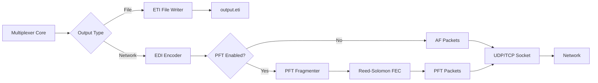

# Output Formats

Overview of output formats for distributing DAB multiplex data.

!!! info "EDI Implementation Status"
    **EDI protocol implementation is complete** (v0.x) with full UDP/TCP support, TIST timestamps, and PFT fragmentation. However, **CLI arguments are not yet available**. For now, use the programmatic API shown in [EDI Network Output](edi-network.md#integration-examples). CLI support coming in next release.

## What Are Outputs?

Outputs deliver the generated ETI (Ensemble Transport Interface) frames to transmitters or recording. python-dabmux supports two output types:

- **ETI files:** Write frames to disk (✅ CLI available)
- **EDI network:** Stream frames over IP with optional error correction (⚙️ API available, CLI pending)

---

## Output Types

| Type | Format | Use Case | Reliability |
|------|--------|----------|-------------|
| **ETI File** | Binary file | Recording, archiving, local processing | 100% |
| **EDI (UDP)** | Network stream | Real-time transmission, low latency | Best-effort |
| **EDI (TCP)** | Network stream | Real-time transmission, guaranteed delivery | Reliable |
| **EDI + PFT** | Network stream with FEC | Lossy networks, long-distance | Very reliable |

---

## Quick Start

### ETI File Output

```bash
python -m dabmux.cli -c config.yaml -o output.eti
```

Generates `output.eti` file containing ETI frames.

### EDI Network Output (UDP)

```bash
python -m dabmux.cli -c config.yaml --edi udp://192.168.1.100:12000
```

Streams ETI as EDI packets over UDP to modulator.

### EDI with PFT (Forward Error Correction)

```bash
python -m dabmux.cli -c config.yaml \
  --edi udp://192.168.1.100:12000 \
  --pft \
  --pft-fec 2 \
  --pft-fec-m 3
```

Streams with PFT fragmentation and Reed-Solomon FEC.

### Combined File and Network

```bash
python -m dabmux.cli -c config.yaml \
  -o archive.eti \
  --edi udp://192.168.1.100:12000
```

Writes file AND streams over network simultaneously.

---

## Output Selection

### ETI Files

**Use when:**
- Recording for archival
- Post-processing required
- Testing and development
- Offline playout
- Guaranteed data integrity

**Advantages:**
- ✅ Perfect reliability (no data loss)
- ✅ Repeatable playout
- ✅ Easy backup and archival
- ✅ Simple file management
- ✅ No network dependencies

**Limitations:**
- ❌ Not real-time (must generate first)
- ❌ Requires disk space
- ❌ No live streaming

See [ETI Files](eti-files.md) for details.

### EDI Network (UDP)

**Use when:**
- Real-time live broadcasting
- Low-latency distribution required
- Transmitter on local network
- Reliable network available

**Advantages:**
- ✅ Real-time streaming
- ✅ Low latency (1-10ms)
- ✅ Multicast support (one-to-many)
- ✅ Standard protocol

**Limitations:**
- ❌ No delivery guarantee (UDP)
- ❌ Packet loss possible
- ❌ Requires network configuration

See [EDI Network](edi-network.md) for details.

### EDI with PFT

**Use when:**
- Network has packet loss
- Long-distance links
- Unreliable networks
- Critical broadcasting (no tolerance for loss)

**Advantages:**
- ✅ Forward error correction
- ✅ Can recover lost packets
- ✅ Automatic fragment reassembly
- ✅ Sequence numbering

**Limitations:**
- ❌ Higher bandwidth (FEC overhead)
- ❌ Slightly higher latency
- ❌ More complex configuration

See [PFT Fragmentation](pft-fragmentation.md) for details.

---

## Output Formats Comparison

### ETI vs EDI

**ETI (Ensemble Transport Interface):**
- Binary frame format
- 6144 bytes per frame (Mode I)
- Contains complete multiplex data
- File-based or can be streamed
- Defined in ETSI EN 300 799

**EDI (Ensemble Data Interface):**
- Network protocol for ETI
- TAG-based packet structure
- Can include timestamps, metadata
- UDP or TCP transport
- Defined in ETSI TS 102 693

**Relationship:**
```
ETI Frames → EDI Encoder → TAG Packets → AF Packets → [Optional: PFT] → UDP/TCP
```

### Frame Rates

**Mode I (standard):**
- Frame duration: 96 ms
- Frame rate: ~10.42 frames/second
- Data rate: 6144 bytes × 10.42 ≈ 64 KB/s

**Other modes:**
- Mode II: 24 ms frames
- Mode III: 24 ms frames
- Mode IV: 48 ms frames

---

## Bandwidth Requirements

### ETI File

**Disk space:**
- Mode I: ~64 KB/s = 3.75 MB/min = 225 MB/hour

**Example:**
- 1-hour broadcast: ~225 MB
- 24-hour broadcast: ~5.4 GB

### EDI Network

**Without PFT:**
- Mode I: ~700 kbps (ETI + protocol overhead)

**With PFT (FEC depth 2, M=3):**
- Mode I: ~900-1000 kbps (additional ~30% overhead)

**Multicast efficiency:**
- 1 encoder → N receivers uses same bandwidth as 1→1

---

## Output Configuration

### CLI Options

**ETI file:**
```bash
-o FILE, --output FILE
```

**EDI network:**
```bash
--edi DESTINATION
```

**PFT options:**
```bash
--pft                      # Enable PFT
--pft-fec DEPTH            # FEC depth (0-20, default: 0)
--pft-fec-m M              # Max correctable fragments (0-20, default: 0)
--pft-fragment-size SIZE   # Fragment size in bytes (default: 512)
```

### Examples

**File only:**
```bash
python -m dabmux.cli -c config.yaml -o output.eti
```

**Network only:**
```bash
python -m dabmux.cli -c config.yaml --edi udp://192.168.1.100:12000
```

**File + Network:**
```bash
python -m dabmux.cli -c config.yaml \
  -o archive.eti \
  --edi udp://192.168.1.100:12000
```

**Network with PFT:**
```bash
python -m dabmux.cli -c config.yaml \
  --edi udp://192.168.1.100:12000 \
  --pft \
  --pft-fec 3 \
  --pft-fec-m 5
```

---

## Output Pipeline



**Flow:**
1. Multiplexer generates ETI frames
2. **File output:** Write directly to disk
3. **EDI output:** Encode as EDI TAG packets
4. **PFT (optional):** Fragment and add FEC
5. **Network:** Send via UDP or TCP

---

## Timestamping

### TIST (Time-stamp in STI-D frame)

**Enable timestamping:**
```bash
python -m dabmux.cli -c config.yaml -o output.eti --tist
```

**Purpose:**
- Synchronize multiple transmitters
- Single Frequency Networks (SFN)
- Precise timing reference

**Timestamp format:**
- 32-bit value in ETI frame
- Resolution: 1/16,384,000 second (~61 ns)
- Epoch: 1970-01-01 00:00:00 UTC

See [Timestamps](../../advanced/timestamps-sync.md) for details.

---

## Multiple Outputs

You can write to file and stream over network **simultaneously**:

```bash
# Archive to file AND stream to transmitter
python -m dabmux.cli -c config.yaml \
  -o /archive/$(date +%Y%m%d_%H%M%S).eti \
  --edi udp://192.168.1.100:12000 \
  --pft \
  --continuous
```

**Use cases:**
- Live broadcasting with archival
- Redundant distribution
- Monitoring and analysis
- Backup and disaster recovery

---

## Performance

### Throughput

**Single output (file or network):**
- Negligible CPU overhead
- Limited by disk I/O or network bandwidth

**Multiple outputs:**
- Linear scaling
- Example: File + EDI ≈ 2× single output overhead

### Latency

| Output Type | Typical Latency |
|-------------|----------------|
| ETI File | N/A (batch) |
| EDI (UDP) | 1-5 ms |
| EDI (TCP) | 5-20 ms |
| EDI + PFT | 10-30 ms |

**PFT adds latency** due to fragment buffering and FEC calculation.

---

## Monitoring

### Enable Verbose Output

```bash
python -m dabmux.cli -c config.yaml -o output.eti -v
```

**Statistics shown:**
- Frames generated
- Bytes written/sent
- Output buffer status
- Network packet statistics (if EDI)
- Underrun/overrun counts

### Example Output

```
INFO: Generated frame 1000
INFO: File output: 6144000 bytes written
INFO: EDI output: 1000 packets sent, 0 errors
INFO: PFT: 0 fragments lost, 0 FEC corrections
```

---

## Troubleshooting

### File Output Issues

**Disk full:**
```
ERROR: Cannot write to output.eti: No space left on device
```
Solution: Free disk space or use different location

**Permission denied:**
```
ERROR: Cannot create output.eti: Permission denied
```
Solution: Check file permissions and directory access

See [Output Issues](../../troubleshooting/output-issues.md) for more.

### Network Output Issues

**Connection refused:**
```
ERROR: Cannot connect to udp://192.168.1.100:12000
```
Solution: Check modulator is listening, firewall allows traffic

**Packet loss:**
```
WARNING: EDI output: high packet loss detected
```
Solution: Enable PFT with FEC, or use TCP instead of UDP

See [Network Issues](../../troubleshooting/network-issues.md) for more.

---

## Best Practices

### File Outputs

1. **Use absolute paths:** Avoid relative paths in production
2. **Monitor disk space:** Set up alerts for low disk space
3. **Rotate files:** Use date-based naming for archival
4. **Compression:** Consider compressing archived ETI files
5. **Backup:** Regularly back up important recordings

### Network Outputs

1. **Use PFT for unreliable networks:** Enable FEC if packet loss > 1%
2. **Dedicated network:** Separate broadcasting from general traffic
3. **QoS:** Configure network QoS for streaming traffic
4. **Monitoring:** Monitor packet loss and latency
5. **Redundancy:** Use multiple paths for critical links

### General

1. **Test first:** Verify outputs before production use
2. **Monitor logs:** Watch for warnings and errors
3. **Validate ETI:** Use ETI validation tools
4. **Document setup:** Keep configuration documented
5. **Disaster recovery:** Have backup outputs configured

---

## Output Decision Matrix

| Scenario | Recommended Output | Reasoning |
|----------|-------------------|-----------|
| Testing / Development | ETI File | Easy, reliable, repeatable |
| Local transmitter (same machine) | ETI File | No network needed |
| Remote transmitter (reliable network) | EDI UDP | Low latency, simple |
| Remote transmitter (unreliable network) | EDI UDP + PFT | FEC recovers packet loss |
| Multiple transmitters | EDI UDP Multicast | Efficient one-to-many |
| Critical broadcast (zero tolerance) | EDI TCP or PFT | Guaranteed delivery |
| Archive + Live | File + EDI | Best of both worlds |
| SFN (Single Frequency Network) | EDI + TIST + PFT | Precise synchronization |

---

## See Also

- [ETI Files](eti-files.md): Detailed ETI file documentation
- [EDI Network](edi-network.md): EDI streaming guide
- [PFT Fragmentation](pft-fragmentation.md): Forward error correction
- [CLI Reference](../cli-reference.md): Complete command-line options
- [Architecture: EDI Protocol](../../architecture/edi-protocol.md): Protocol details
